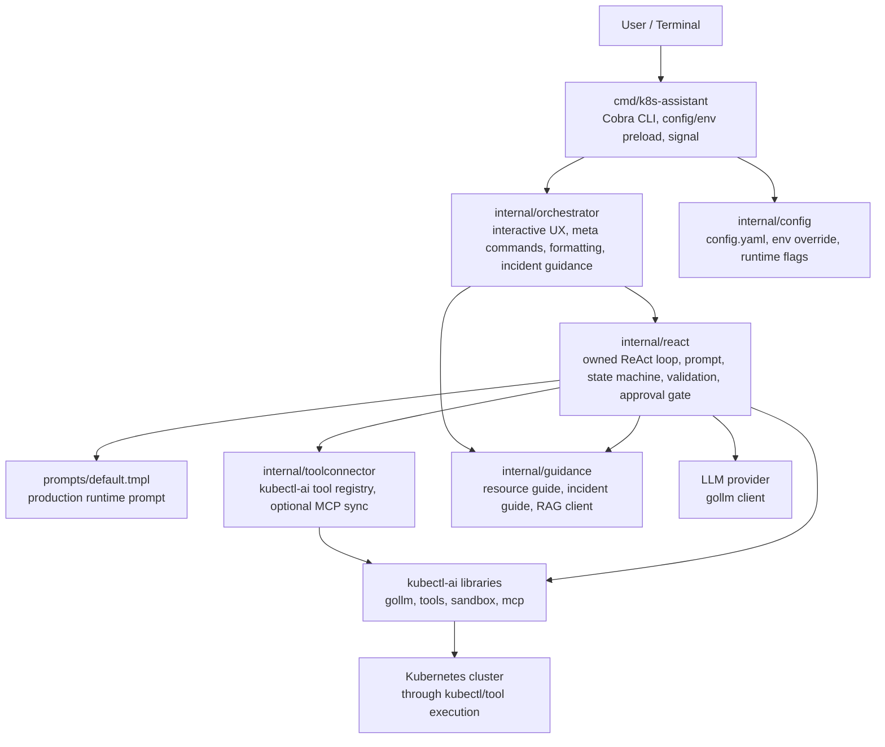
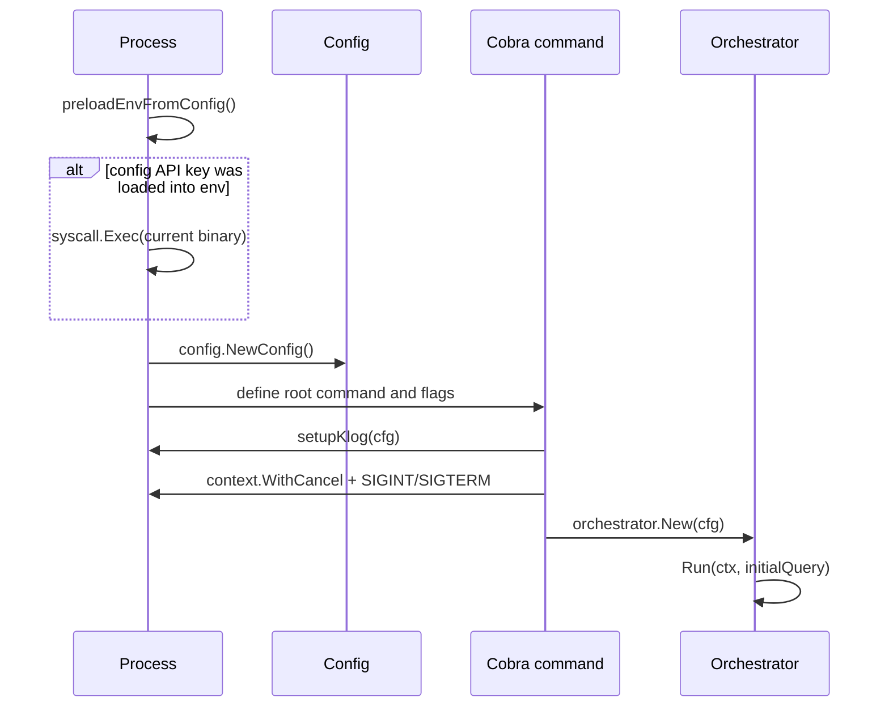
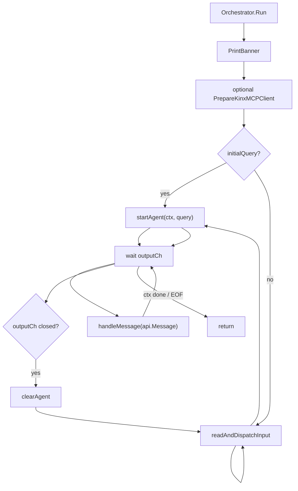
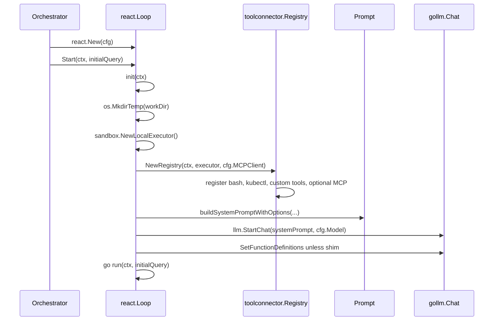
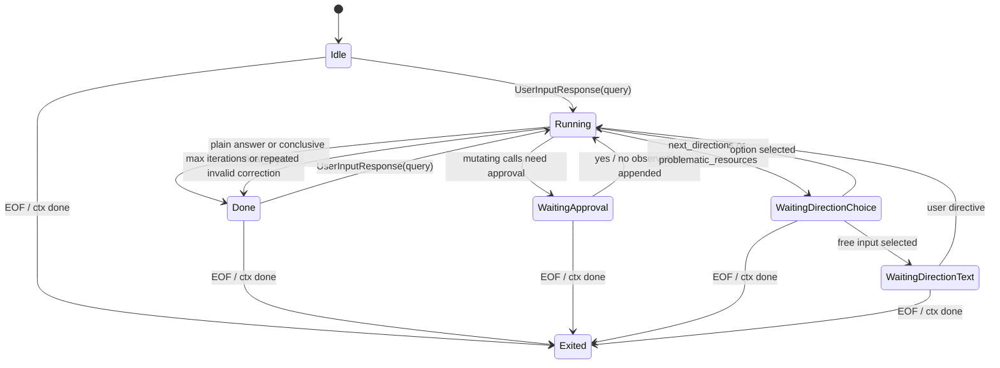
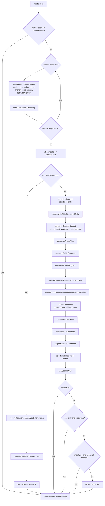
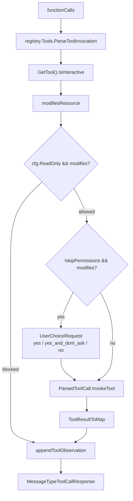

# Orchestrator와 ReAct Loop 구조

이 문서는 현재 코드 기준으로 `k8s-assistant`의 실행 구조를 설명한다. 중심 범위는 `cmd/k8s-assistant`, `internal/orchestrator`, `internal/react`이며, 도구 등록, guidance, prompt, config는 이 흐름을 이해하는 데 필요한 만큼만 연결해서 다룬다.

관련 상세 계약 문서:

- [`request_processing_phases.md`](./request_processing_phases.md): 자연어 요청을 `requirement_analysis`, `phase_plan`, `phase_progress`로 처리하는 phase 계약.
- [`guide_progress_and_continuation.md`](./guide_progress_and_continuation.md): resource guide 주입 이후 `guide_step`, `final_report`, `next_directions` 흐름.
- [`requirement_analysis.md`](./requirement_analysis.md): 요구사항 분석 구조.

## 1. 전체 구조

`k8s-assistant`는 `kubectl-ai`의 Agent를 그대로 실행하지 않는다. 이 프로젝트가 ReAct loop, 승인 UX, read-only enforcement, prompt rendering, output formatting, guidance orchestration을 직접 소유하고, `kubectl-ai`는 `gollm`, `pkg/tools`, `pkg/sandbox`, `pkg/mcp` 같은 라이브러리 계층으로 사용한다.



핵심 패턴:

- **Layered architecture**: CLI, orchestration, ReAct runtime, tool connector, guidance가 계층별 책임을 가진다.
- **Mediator**: `Orchestrator`가 사용자 입력, agent output, formatter, logger, guidance flow 사이를 중재한다.
- **State machine**: `react.Loop`는 명시적 상태 enum으로 ReAct 진행, 승인 대기, 후속 방향 선택을 관리한다.
- **Adapter/facade**: `internal/toolconnector.Registry`가 kubectl-ai tool system과 MCP tool 등록을 k8s-assistant 경계 안으로 감싼다.
- **Presenter**: `Formatter`가 agent message를 CLI 표시용 문자열로 변환한다.
- **Policy gate**: read-only, approval, target validation, guidance phase validation은 tool 실행 전 runtime에서 강제된다.

## 2. CLI 부트스트랩

CLI 진입점은 `cmd/k8s-assistant/main.go`이다. 이 계층은 실제 ReAct 판단을 하지 않고 실행 환경을 준비한 뒤 `orchestrator`로 넘긴다.



중요한 동작:

- `preloadEnvFromConfig`는 `~/.k8s-assistant/config.yaml`에서 provider별 API key와 endpoint를 읽어 환경변수로 넣고, 값이 새로 설정되면 같은 바이너리를 `syscall.Exec`로 재실행한다.
- 이 재실행은 `gollm`이 일부 provider 환경변수를 `init()` 시점에 읽는 문제를 피하기 위한 부트스트랩 전략이다.
- `config.NewConfig`는 기본값, config file, env override를 적용한다. CLI flag는 Cobra flag binding으로 이후 덮어쓴다.
- `setupKlog`는 기본적으로 콘솔 로그를 숨기고 `~/.k8s-assistant/logs/k8s-assistant-YYYYMMDD.log`에 시스템 로그를 쓴다.
- `run()`은 `cfg.PromptTemplateFile`이 비어 있을 때 바이너리 기준 `../prompts/default.tmpl`을 찾아 채운 뒤 `orchestrator.New`를 호출한다.

CLI 계층의 책임은 여기까지다. 사용자와 agent 사이의 대화 흐름은 `Orchestrator.Run`이 소유한다.

## 3. Orchestrator 책임

`internal/orchestrator.Orchestrator`는 CLI UX와 `react.Loop` 사이의 중재자다. Kubernetes tool 실행 판단은 하지 않지만, 사용자 입력, 출력 표시, 메타 명령, incident guidance offer, agent lifecycle을 관리한다.

주요 필드:

| 필드 | 책임 |
|---|---|
| `cfg` | 전체 runtime config 참조. 메타 명령이 이 값을 변경할 수 있다. |
| `agentWrap` | 현재 활성 `*react.Loop`. 필요할 때만 생성하는 lazy agent이다. |
| `outputCh` | `react.Loop.Output()`에서 받은 `api.Message` stream. |
| `agentInitErr` | agent 초기화 실패 원인 보관. |
| `ctx` | tool result ref 저장용 최근 대화 context. |
| `incidentGuidance` | agent text/tool evidence를 관찰해 incident guidance offer를 관리. |
| `formatter` | Markdown rendering, tool result 표시 여부, propose block 등 CLI presenter. |
| `logger` | 선택적 대화 로그. |
| `rl` | 일부 meta command에서 쓰는 readline instance. |
| `kubeconfigInfo` | prompt prefix와 context 변경에 쓰는 kubeconfig metadata. |

### 3.1 Orchestrator 실행 루프

`Run(ctx, initialQuery)`는 두 모드가 섞인 event loop다.

- `agentWrap == nil`: agent가 없는 상태다. 직접 사용자 입력을 받고, 일반 쿼리면 `startAgent`로 loop를 만든다.
- `agentWrap != nil`: agent output channel을 읽고 `handleMessage`로 분배한다.



### 3.2 사용자 입력과 meta command

일반 입력은 `getInputWithUIEcho`를 통해 받는다. slash command는 기본적으로 `handleMetaCommand`로 처리하고 agent로 보내지 않는다. 예외적으로 ReAct loop가 `StateWaitingDirectionText`에서 후속 진단 방향 free-text를 기다리는 동안에는 raw slash input을 loop에 전달한다. 이 상태에서는 `/exit`, `/quit`, `/clear`, `/reset` 같은 loop-local control input이 orchestrator meta command에 의해 빈 입력으로 바뀌지 않는다.

현재 user-facing meta command:

| 명령 | 처리 |
|---|---|
| `/help` | 도움말 출력 |
| `/config` | 현재 설정 출력 |
| `/kubeconfig` | kubeconfig 경로 설정 |
| `/kube-context` | context 조회, 선택, 변경 |
| `/model` | 모델 변경 |
| `/lang` | 출력 언어 조회/변경 |
| `/readonly` | read-only 모드 조회/변경 |
| `/save` | config 저장 |

agent invalidation이 필요한 변경:

- `/kubeconfig`
- `/kube-context switch`
- `/model`
- `/lang Korean|English`
- `/readonly on|off`

이 변경들은 기존 `react.Loop`의 prompt, tool registry, language translator, read-only policy, kubeconfig 실행 환경에 영향을 주므로 `invalidateAgent(reason)`으로 loop를 닫고 다음 쿼리에서 새로 만든다.

command argument로 전달된 initial query는 run-once로 처리한다. 해당 query가 끝나고 agent가 다음 `MessageTypeUserInputRequest`를 보내면 orchestrator는 interactive continuation을 열지 않고 agent를 닫아 프로세스를 종료한다.

### 3.3 Agent message 처리

`react.Loop`와 orchestrator 사이의 protocol은 kubectl-ai의 `api.Message` 타입이다. Orchestrator는 message type별로 UI 표시, masking, logging, guidance observation을 수행한다.

| Message type | Orchestrator 동작 |
|---|---|
| `MessageTypeText` | agent/model text를 sanitize, masking, Markdown rendering 후 출력. incident guidance offer 후보로 관찰. |
| `MessageTypeError` | error formatter로 출력하고 로그 기록. |
| `MessageTypeToolCallRequest` | 실행 중인 tool 설명을 출력. |
| `MessageTypeToolCallResponse` | tool result를 sanitize/masking하고 `ConversationContext`에 `ref_N`으로 저장. 필요하면 화면에 출력. incident evidence로 기록. |
| `MessageTypeUserInputRequest` | 사용자 입력을 받아 `api.UserInputResponse`로 active agent에 전달. |
| `MessageTypeUserChoiceRequest` | 승인 또는 direction choice를 번호 선택 UX로 렌더링하고 `api.UserChoiceResponse` 전달. |

이 구조 때문에 `react.Loop`는 터미널 UX를 몰라도 되고, `Orchestrator`는 LLM/tool 판단을 몰라도 된다.

## 4. ReAct Loop lifecycle

`internal/react.Loop`는 이 프로젝트가 직접 소유하는 runtime이다. `New(cfg)`는 LLM client와 input/output channel만 만든다. 실제 tool registry, executor, prompt, chat session은 `Start(ctx, initialQuery)` 이후 `init(ctx)`에서 준비된다.



`Close()`는 cancel, input EOF signal, registry close, executor close, llm close, temp workdir removal을 한 번만 수행한다. Orchestrator는 agent invalidation이나 process 종료 시 이 lifecycle을 닫는다.

## 5. ReAct 상태 머신

`Loop.run`은 명시적인 state machine이다.



상태별 책임:

| 상태 | 의미 |
|---|---|
| `StateIdle` | 아직 active query가 없고 사용자 입력을 기다린다. |
| `StateRunning` | LLM 호출, structured output 처리, tool 분석과 실행을 진행한다. |
| `StateWaitingApproval` | mutating tool call에 대한 사용자 승인 대기. |
| `StateWaitingDirectionChoice` | inconclusive report 이후 후속 진단 방향 또는 관련 리소스 조사 선택 대기. |
| `StateWaitingDirectionText` | 사용자가 직접 후속 진단 방향을 입력하는 단계. |
| `StateDone` | 현재 query 처리 완료. 다음 사용자 입력을 기다릴 수 있다. |
| `StateExited` | loop 종료. |

## 6. Query 시작과 context 초기화

`startQuery(query)`는 매 요청의 시작점이다.

주요 순서:

1. `classifyRequestIntent(query)`로 manifest/general 등 요청 의도를 분류한다.
2. 이전 요청의 state가 있으면 `captureConversationMemory()`로 compact memory를 보존한다.
3. 새 tool profile과 prompt options를 만들고 `resetChatSession()`으로 system prompt와 chat session을 재생성한다.
4. user message를 output으로 보낸다.
5. `priorConversationStateMessage()`가 있으면 현재 LLM content 앞에 넣는다.
6. `requirementAnalysisPrompt()`와 `requirementAnalysisDefinitionPrompt()`를 먼저 넣고, 마지막에 user query를 넣는다.
7. 현재 request state, phase state, guide state, action record, final report state를 초기화한다.
8. state를 `StateRunning`으로 전환한다.

이 설계의 핵심은 매 query마다 model에게 바로 tool action을 허용하지 않고, 먼저 structured `requirement_analysis`를 통과시키는 것이다.

## 7. runIteration 파이프라인

`runIteration(ctx)`는 ReAct loop의 핵심이다. 현재 구현은 단순히 "LLM이 tool을 고르면 실행"이 아니라, 여러 structured output gate를 순서대로 통과시키는 runtime pipeline이다.



### 7.1 Iteration anchors

`buildIterationSendContent()`는 `currChatContent` 앞에 compact anchor를 붙인다.

실제 prepend 순서:

1. `guideStepAnchor()`
2. `phaseStepAnchor()`
3. `requirementAnalysisAnchor()`

최종 slice에서는 마지막에 prepend된 `requirement_analysis` anchor가 가장 앞에 온다. 즉 model은 original request와 accepted analysis, active phase, active guide step, 최신 observation 순으로 문맥을 받는다.

anchor의 목적:

- `requirementAnalysisAnchor`: follow-up이나 긴 진단에서 원래 target/scope가 drift하지 않게 한다.
- `phaseStepAnchor`: model-declared top-level phase plan을 계속 따르게 한다.
- `guideStepAnchor`: guide가 주입된 뒤 nested diagnostic step 진행률과 다음 step을 유지한다.

### 7.2 Native function calling과 shim mode

두 실행 모드를 모두 지원한다.

| 모드 | 동작 |
|---|---|
| Native function calling | `chat.SetFunctionDefinitions`로 실제 tool schemas와 runtime-internal structured function schemas를 provider에 주입하고, response part의 function calls를 수집한다. |
| Shim mode | prompt에 tool schema JSON을 넣고, model은 단일 `json` code block을 출력한다. `candidateToShimCandidate`가 text를 `reActResponse`로 parse한 뒤 synthetic function call로 변환한다. |

native mode에서 provider에 등록되는 runtime-internal structured calls:

```text
__requirement_analysis__, __request_context__, __phase_plan__, __phase_progress__,
__guide_progress__, __resource_guide_lookup__, __final_report__, __next_directions__
```

이 call들은 Kubernetes tool이 아니라 ReAct runtime state를 갱신하는 structured outputs다. 특히 `__guide_progress__`는 native mode에서 `kubectl`/`bash` arguments에 섞지 않고 별도 function call로 처리한다. `__guide_progress__`가 마지막 nested guide step을 완료하면 runtime은 즉시 `guided_diagnosis` phase completion을 위한 `__phase_progress__` 또는 guide 밖의 `__final_report__` directive를 queue한다.

shim parser는 `requirement_analysis`, `phase_plan`, `phase_progress`, `resource_guide_lookup`, `final_report`, `next_directions`, `action`, `answer`를 구분한다. runtime은 이 structured output을 내부 call name인 `__phase_plan__` 같은 이름으로 normalize한다. shim mode의 tool JSON listing에는 runtime-internal calls를 섞지 않아 기존 JSON code block protocol을 유지한다.

### 7.3 Requirement analysis gate

`requireRequirementAnalysisBeforeAction`은 accepted `requirement_analysis` 없이 action, answer, guide lookup, phase plan 이후 작업으로 넘어가는 것을 막는다.

`consumeRequestContext`는 다음을 수행한다.

- `requirement_analysis` schema와 semantic validity를 확인한다.
- follow-up이면 이전 `request_context`를 적용해 target/scope defaulting을 수행한다.
- clarification이 필요하면 user-facing 질문을 내고 request를 종료한다.
- accepted analysis 이후 `resetChatSessionAfterRequirementAnalysis()`로 prompt를 재구성한다.
- concrete primary target이 있으면 Kubernetes discovery로 built-in/CRD/unknown을 분류한다.

### 7.4 Phase plan and phase progress gate

`requirePhasePlanBeforeAction`은 accepted requirement analysis 이후 `phase_plan` 없이 tool action이나 answer로 가는 것을 막는다.

`phasePlan`은 다음 조건을 만족해야 한다.

- `request_goal`이 있어야 한다.
- `phase_steps` 또는 backward-compatible `phases`가 있어야 한다.
- 각 step은 `index`, `name`, `goal`, `completion_condition`이 필요하다.
- `allowed_next`에 들어간 이름은 같은 plan의 `phase_steps[].name`으로 선언되어야 한다.
- `allowed_next`는 forward-only edge여야 한다. 같은 index 또는 이전 index의 phase로 되돌아가는 back-edge/cycle은 validation에서 거부된다.
- 뒤에 더 큰 index의 step이 있는 non-terminal step은 적어도 하나의 `allowed_next`가 필요하다.

예외적으로 single-step `lightweight_lookup` phase는 `phase_plan`과 첫 `action`을 같은 응답에 포함할 수 있다. 그 외에는 `phase_plan`만 먼저 받아들인다.

`guide_progress`는 `phase_progress`보다 먼저 소비된다. 따라서 native model이 같은 응답에 `guide_progress`와 `phase_progress`를 함께 내면 guide step completion을 먼저 기록한 뒤 parent phase completion을 검증할 수 있다. `guide_progress` 뒤에 trailing call이 있으면 silently drop하지 않고 남은 pipeline으로 넘긴다.

`phase_progress`는 active phase만 완료할 수 있다. `next_phase`가 있으면 현재 step의 `allowed_next`에 포함된 이름이어야 한다. 생략되면 첫 번째 allowed next phase로 진행한다.

guide 완료 후 runtime이 `phase_progress` 또는 `final_report`를 이미 요청한 상태라면, 이후 응답은 해당 requested structured call 하나만 허용된다. 기대한 call과 다른 action/tool call이 함께 있으면 correction을 다시 queue해 동반 call이 조용히 버려지거나 실행되지 않게 한다.

## 8. Tool 실행과 승인 흐름

tool call은 structured validation을 통과한 뒤에만 `analyzeToolCalls`로 들어간다.



`requestApproval()`는 pending call descriptions를 보여주고 세 선택지를 제공한다.

- `예`: 이번 pending calls만 실행한다.
- `예, 이후 묻지 않기`: `skipPermissions=true`로 두고 이후 mutating calls의 승인 prompt를 생략한다.
- `아니오`: 각 pending call에 declined observation을 append하고 loop를 계속한다.

중요한 예외: `read-only` 모드는 `skipPermissions`보다 강하다. 사용자가 이전에 "이후 묻지 않기"를 선택했더라도 `cfg.ReadOnly`가 켜져 있으면 mutating call은 `rejectReadOnlyModifyingCalls()`에서 차단된다.

## 9. Read-only enforcement

read-only enforcement는 prompt instruction만이 아니라 runtime policy다.

`modifiesResource` 판정 순서:

1. observation tool name이면 `no`.
2. kubectl invocation에 read-only fast path에서 금지된 shell evaluation syntax 또는 허용되지 않은 read-only subcommand가 있으면 `unknown`.
3. kubectl invocation이 read-only pipeline이면 `no`.
4. 그 외에는 kubectl-ai tool의 `CheckModifiesResource` 결과를 사용한다.

read-only kubectl pipeline으로 인정되려면:

- command list의 각 segment가 read-only kubectl pipeline이어야 한다.
- 첫 pipeline segment가 `kubectl`이고 verb가 허용 목록이어야 한다.
- 이후 pipeline segment는 safe local text processor여야 한다.
- shell redirection은 금지된다.
- command substitution `$()`, backtick substitution, heredoc, process substitution은 금지된다.
- 어느 segment 안에도 mutating kubectl verb가 있으면 금지된다.

현재 read-only verb:

```text
get, describe, logs, top, api-resources, api-versions, version, config, auth
```

`kubectl auth`는 verb만으로 허용하지 않는다. read-only fast path에서는 `auth can-i`, `auth whoami`만 allowlist로 허용하고, 나머지 auth subcommand는 `unknown`으로 분류해 read-only mode에서 차단한다.

현재 mutating verb:

```text
apply, delete, patch, replace, edit, scale, set, create, annotate, label, cordon, uncordon, drain, taint
```

safe local pipeline command:

```text
tail, head, grep, egrep, fgrep, awk, sed, sort, uniq, wc, cut, jq, yq, column
```

예시:

```bash
kubectl get pods -n app | tail -20
```

위 command는 첫 segment가 read-only kubectl이고 뒤가 safe local processor라 허용된다.

```bash
kubectl get pod app -o yaml | kubectl apply -f -
```

위 command는 pipeline 안에 mutating kubectl verb가 있으므로 차단된다.

## 10. Guidance 경계

이 프로젝트에는 두 종류의 guidance 흐름이 있다.

```mermaid
flowchart LR
    UserQuery["User query"]
    React["react.Loop"]
    Phase["phase_plan reaches guidance_lookup"]
    Discovery["runtime CRD discovery"]
    RGLookup["resource_guide_lookup structured output"]
    RGClient["guidance.NewResourceGuideClient"]
    GuideAnchor["guideStepState + guide_step anchor"]
    Orch["orchestrator.IncidentGuidanceFlow"]
    TextEvidence["agent text / tool evidence"]
    Offer["ask user: find resolution?"]
    IncidentClient["guidance.NewIncidentClient"]
    RemediationPrompt["user-approved remediation prompt back to react"]

    UserQuery --> React --> Phase --> Discovery --> RGLookup --> RGClient --> GuideAnchor --> React
    TextEvidence --> Orch --> Offer --> IncidentClient --> RemediationPrompt --> React
```



### 10.1 Resource guide

resource guide는 `react.Loop` 안에서 model-selected structured output으로만 진입한다.

진입 조건:

- active top-level phase가 `guidance_lookup`이어야 한다.
- runtime discovery가 primary target을 CRD로 확인해야 한다.
- 동일 refined query를 반복하지 않아야 한다.

`searchAndInjectResourceGuide`는 `guidance.NewResourceGuideClient`를 만들고 Qdrant provider일 때만 guide search를 수행한다. provider가 Qdrant가 아니거나 search 실패, filter 결과 없음이면 unavailable observation을 주입하고 일반 진단을 계속하게 한다.

guide가 있으면:

- `buildGuideStepState`로 top guide case의 diagnostic steps를 runtime state로 저장한다.
- accepted `phase_plan`에 `guided_diagnosis` phase가 있는지 확인하고 그 phase로 진입한다.
- prompt options에 guidance protocol과 필요 시 Cluster API guardrail을 포함한다.
- context size에 따라 compact 후 guide observation을 넣거나 현재 content를 보존한 채 chat session을 reset한다.

guide step은 top-level phase가 아니다. `guide_progress`는 active phase가 `guided_diagnosis`일 때 nested guidance step 완료만 표시한다. 모든 guide step이 완료되면 runtime은 먼저 `guided_diagnosis` phase를 `phase_progress`로 완료하도록 요구하고, 이후 `final_report`로 넘어간다. 모델이 이 directive를 무시하고 다른 action을 반복하면 runtime은 correction과 directive를 다시 queue해 MaxIterations까지 표류하지 않게 한다.

resource guide provider 정책은 타입별로 분리되어 있다. 현재 ReAct resource guide lookup은 Qdrant provider만 구현한다. endpoint/local provider가 설정되어 있으면 `provider_not_implemented_for_resource_guides=<provider>` unavailable observation을 주입하고 일반 진단을 계속한다.

### 10.2 Incident guidance

incident guidance는 `orchestrator`가 관리한다. model이 tool로 호출하는 구조가 아니다.

흐름:

1. `ObserveUserInput`이 최근 user query를 저장한다.
2. `AfterAgentText`와 `RecordEvidence`가 장애 징후 텍스트를 관찰한다.
3. generic lookup/summary 요청은 offer 대상에서 제외한다.
4. concrete failure signal이 보이면 다음 사용자 입력 전에 "해결 방법을 찾아볼까요?"를 묻는다.
5. 사용자가 동의하면 `guidance.NewIncidentClient`로 runbook/knowledge 기반 summary를 만든다.
6. 다시 "해결을 진행할까요?"를 묻고, 동의하면 remediation prompt를 `react.Loop`에 user input처럼 넣는다.

incident guidance도 Kubernetes 변경을 직접 실행하지 않는다. remediation prompt는 English로 작성되며 "현재 상태를 다시 확인하고, 변경 전에는 반드시 사용자 승인을 받으라"는 규칙을 포함해 ReAct/tool loop로 돌아간다. user-facing 출력 언어는 remediation prompt가 아니라 active system language policy와 translator 설정이 결정한다.

## 11. Final report와 continuation

`final_report`는 guide 진단이 끝났거나 model이 충분한 evidence를 확보했다고 판단할 때 request를 닫는 structured output이다.

conclusive report:

- `attempted`, `evidence_known`, `most_likely_cause`, `conclusion`이 필요하다.
- `problematic_resources`가 없으면 report를 출력하고 `StateDone`으로 간다.
- `problematic_resources`가 있으면 runtime이 관련 리소스 추가 조사 선택지를 만든다.

inconclusive report:

- `attempted`, `most_likely_cause`, 그리고 `evidence_known`, `evidence_missing`, `blockers` 중 하나가 필요하다.
- report 출력 후 runtime은 model에게 `next_directions`를 요구한다.
- `next_directions`는 1-3개 option을 제안한다.
- runtime은 "직접 다른 방향 입력"과 "여기서 진단 종료"를 user choice에 추가한다.

선택지 종류:

| kind | 의미 | runtime 처리 |
|---|---|---|
| `another_guide` | 다른 resource family/problem focus로 guide angle 재시도 | guide state를 reset하고 pre-guidance phase로 되감은 뒤, phase workflow가 다시 `guidance_lookup`에 도달하게 한다. |
| `different_approach` | guide가 아닌 다른 진단 지시 | user-approved directive를 `currChatContent`에 넣고 `StateRunning`으로 재개한다. |
| `investigate_resource` | conclusive report의 관련 문제 리소스 추가 조사 | 새 query처럼 `startQuery`를 호출해 requirement analysis부터 다시 시작한다. |

## 12. Prompt와 language policy

production prompt는 `prompts/default.tmpl`이다. `prompts/system_ko.tmpl`는 Korean reference/convenience prompt이며 기본 경로라고 가정하지 않는다.

CLI flag parsing 이후에는 provider-specific credential aggregation을 다시 수행한다. 이로써 config/env로 만들어진 `cfg.APIKey`가 CLI `--llm-provider` 변경 뒤에도 이전 provider 값으로 남지 않는다. `/save`는 runtime aggregate인 generic `apikey`/`endpoint`를 저장하지 않고 provider-specific configured fields만 보존한다.

`buildSystemPromptWithOptions`는 다음 입력으로 prompt를 만든다.

- tool definitions JSON
- tool names
- shim enabled 여부
- read-only 여부
- user language
- translation runtime 사용 여부
- guidance protocol 포함 여부
- manifest guideline 포함 여부
- Cluster API guardrail 포함 여부
- tool profile

prompt cache key는 template path, prompt profile hash, tool profile hash, shim/read-only/language/translate option을 포함한다.

tool profile은 현재 conservative하게 모든 registered tool을 유지한다. 의도 기반 tool pruning은 하지 않고, stable hash와 prompt caching을 위한 profile name/hash만 제공한다.

language policy:

- `lang.language=English`: model-facing/user-facing 자연어는 English.
- `lang.language=Korean`이고 translation model이 설정되지 않음: main model이 Korean으로 응답한다.
- `lang.language=Korean`이고 `lang.model`과 `lang.endpoint`가 설정됨: main model은 English로 reasoning/answer를 만들고, user-facing text만 `langTranslator`가 Korean으로 번역한다.
- translation은 OpenAI-compatible chat completions endpoint만 사용한다.
- Kubernetes resource names, commands, flags, JSON/YAML, field names, raw command output은 번역하거나 변형하지 않아야 한다.

## 13. Context compaction

`react.Loop`는 대화가 길어질 때 전체 raw history를 계속 들고 가지 않는다.

관리 대상:

- original query
- accepted requirement analysis
- request context
- resource classification
- last correction
- injected guide references
- completed action summaries
- last assistant text
- prior conversation memory

compaction trigger:

- 다음 send 전에 estimated context가 model limit의 약 80%에 도달한 경우.
- context length error가 발생한 경우.
- correction이나 guide injection처럼 state rewrite가 필요한 경우.

compacted state는 `compactedStateMessage(nextInstruction)`으로 만들어지며, original request, accepted analysis, compacted clues, guide refs, last answer 등을 요약해 새 chat session에 넣는다.

## 14. Tool connector와 MCP 경계

`internal/toolconnector.Registry`는 kubectl-ai tool system을 감싼다.

등록 순서:

1. `tools.Tools.Init()`
2. `tools.NewBashTool(executor)`
3. `tools.NewKubectlTool(executor)`
4. `~/.config/kubectl-ai/tools.yaml` 또는 `XDG_CONFIG_HOME/kubectl-ai/tools.yaml` custom tools
5. `--mcp-client`가 켜진 경우 MCP tools

MCP config는 k8s-assistant의 명시적 config만 사용한다.

- source: `~/.k8s-assistant/mcp.yaml`
- destination for kubectl-ai library: kubectl-ai default MCP config path
- URL server는 간단한 TCP dial check를 수행한다.
- 이 파일에 없는 MCP server는 로딩하지 않는다.

guidance는 MCP server가 아니다. resource guide와 incident guide는 `internal/guidance` client/service로 직접 호출된다.

## 15. 개발 작업 가이드

### 15.1 Meta command 추가

수정 지점:

- `GetMetaCommands`
- `filterMetaCommands`가 prefix matching에 사용하므로 command name만 추가하면 autocomplete 대상이 된다.
- `handleMetaCommand`에 실제 dispatch 추가.
- runtime behavior가 바뀌는 command면 `invalidateAgent(reason)` 호출 여부를 검토한다.
- config persistence가 필요하면 `/save`와 `Config.Save()` field tag를 확인한다.

### 15.2 ReAct structured output 추가

수정 지점:

- `shim.go`: response struct, parsing, shim part conversion.
- `loop.go`: internal call constant, normalization, `runIteration` consume order.
- 별도 파일에 `consumeX`와 validation 구현.
- `prompts/default.tmpl`: native/shim 양쪽 contract 업데이트.
- tests: shim parsing, runIteration gate, invalid schema correction.

주의점:

- structured output은 "tool name"이 아니라 runtime protocol이다.
- `action.name`에 내부 call name이 들어오면 correction해야 한다.
- 한 iteration에서 허용할 수 있는 output 조합을 명확히 해야 한다.

### 15.3 Tool 또는 MCP 변경

수정 지점:

- built-in/custom/MCP 등록은 `internal/toolconnector` 경계를 우선 사용한다.
- model prompt에 tool schema가 들어가는 방식은 `prompt.go`와 `default.tmpl`을 함께 확인한다.
- read-only 정책에 영향을 주는 tool이면 `modifiesResource`, `isObservationToolName`, `CheckModifiesResource` 경계를 검토한다.

### 15.4 Guidance 변경

원칙:

- resource guide는 `guidance_lookup` phase와 `resource_guide_lookup` structured output을 통해 들어가야 한다.
- incident guidance는 orchestrator offer flow를 통해 들어가야 한다.
- guidance가 직접 Kubernetes 변경을 실행하지 않는다.
- 변경 실행은 항상 ReAct/tool loop와 approval/read-only gate를 통과해야 한다.

### 15.5 Prompt 변경

원칙:

- `prompts/default.tmpl`가 primary production prompt다.
- Korean convenience prompt를 production default로 가정하지 않는다.
- shim mode와 native mode를 모두 유지한다.
- JSON schema, command, resource names, raw output 보존 규칙을 깨지 않는다.

## 16. 테스트 기준

문서 변경만이면 build는 필요 없다. 코드 변경이 있으면 변경 영역에 맞는 focused test를 우선 실행한다.

관련 테스트 예:

```bash
GOCACHE=/Users/ngkim/workspaces/kinx-k8s-assistant/.cache/go-build go test ./internal/react ./internal/orchestrator ./internal/config -count=1
```

문서만 변경한 이번 작업의 verification은 다음으로 충분하다.

```bash
git diff --check
```
