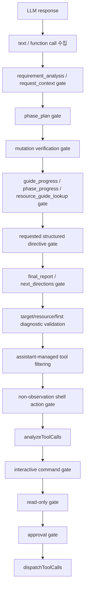
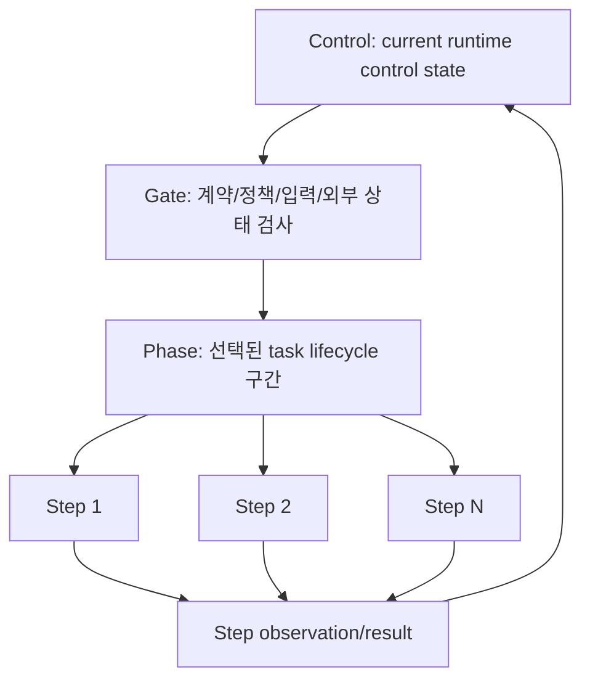

# ReAct Runtime Renewal 계획 기준 문서

이 문서는 `internal/react`의 gate 처리 구조를 바로 바꾸기 전에, 현재 코드와 충돌하지 않는 공통화 방향과 실행 순서를 정리하기 위한 계획 기준 문서다. 목표는 read-only, structured output, mutation verification, guidance, approval gate가 서로 다른 의미의 차단을 같은 방식으로 오해하지 않게 만들고, 이후 4-6회에 나누어 코드 구조를 리뉴얼할 수 있는 작업 단위를 고정하는 것이다.

## 문서 목적

이 문서는 구현 PR 설명서가 아니라 **다음 작업들을 지시하기 위한 기준 문서**다. 따라서 아래 질문에 답해야 한다.

- 현재 코드에서 `Control`, `Gate`, `Phase`, `Step`이 각각 어디에 섞여 있는가
- 어떤 항목을 gate로 남기고, 어떤 항목을 phase 또는 step으로 내려야 하는가
- gate가 실패했을 때 단순 차단인지, 모델 출력 correction인지, agent command retry인지, 사용자 요청 blocker인지 어떻게 구분하는가
- gate가 특정 phase 또는 step으로 재분기해야 할 때 어떤 주소 체계가 필요한가
- 4-6번 정도의 실행 요청으로 리뉴얼 구조에 도달하려면 어떤 순서로 바꿔야 하는가

## 첫 계획 대비 변경된 내용

처음 계획은 `GateOutcome`을 중심으로 read-only/self-talk/read-only unknown 같은 gate 결과를 구분하는 데 초점이 있었다. 이후 검토를 거치며 목표가 더 넓어졌다.

| 항목 | 첫 계획 | 현재 계획 |
| --- | --- | --- |
| 핵심 목표 | gate 결과 타입화 | `Control/Gate/Phase/Step` 전체 계층 정리 |
| Gate 의미 | 차단 또는 correction 결과 | runtime 흐름을 결정하는 gate boundary |
| Phase 의미 | 기존 `phase_steps` 흐름 유지 | Agent가 처리하는 업무 단위로 재정의 |
| Step 의미 | guide/mutation verification 일부에만 적용 | Phase 내부 최소 수행 단위로 일반화 |
| 재분기 | command retry 중심 | gate가 phase/step을 target으로 지정할 수 있게 확장 |
| read-only 수정 | 개별 버그 수정 | command policy gate의 한 타입으로 편입 |
| mutation verification | pending 상태 중심 | mutation 실행 후 verification phase/step lifecycle로 정리 |
| user input | input owner 중심 | Control 상태에서 입력 타입을 분류하고 handler를 결정 |
| RAG/guidance | resource guide와 incident guidance 분리 설명 | guidance/runbook도 gate를 통과하는 phase 분기로 정리 |

가장 큰 변경점은 `GateOutcome`만 추가해서는 충분하지 않다는 결론이다. gate가 특정 phase 또는 step으로 재분기하려면 먼저 phase와 step을 주소 지정할 수 있어야 한다. 따라서 실제 적용 순서는 **주소 체계 → gate outcome → command gate → structured gate → step adapter → phase rebranch** 순서가 되어야 한다.

## 리뉴얼 최종 목표

목표 구조는 아래 개념을 기준으로 한다. 구현 논의에서는 짧게 `Control/Gate/Phase/Step`이라고 부르되, 문서와 코드에서는 정식 의미를 기준으로 해석한다.

```text
Control = runtime control state
Gate    = runtime gate boundary
Phase   = task lifecycle phase
Step    = execution/evidence step

1 Phase = N Steps
```

정식 표현은 아래와 같다.

| 약칭 | 정식 표현 | 정의 |
| --- | --- | --- |
| Control | runtime control state | Agent가 현재 어떤 control role에 있는지를 나타내는 파생 상태 |
| Gate | runtime gate boundary | 모델 출력, command, 정책, 사용자 입력, 외부 상태를 검사하고 다음 흐름을 결정하는 분기 경계 |
| Phase | task lifecycle phase | 사용자 목표를 달성하기 위한 top-level 작업 구간 |
| Step | execution/evidence step | phase 내부에서 수행되는 최소 실행, 관찰, 검증, 또는 종합 단위 |

최종적으로 runtime은 아래 능력을 가져야 한다.

- 현재 runtime control role을 `ControlState`로 일관되게 파생한다.
- 모든 주요 gate는 같은 결과 구조로 "허용/수정/재시도/차단/재분기"를 표현한다.
- phase는 top-level 업무 단위로 표현하고, 기존 `phase_steps` 명칭 혼동을 코드 내부에서 줄인다.
- step은 guide step, mutation evidence requirement, 일반 action을 모두 주소 지정할 수 있다.
- read-only unknown, shell self-talk, target mismatch 같은 agent command 오류는 final report가 아니라 current phase/step retry로 돌아간다.
- read-only mutation, approval denial 같은 사용자 요청 blocker는 agent retry와 분리된다.
- mutation 이후에는 verification phase/step이 완료되기 전 final report로 빠지지 않는다.
- guidance/runbook 검색 실패는 실패로 끝나며, 다른 RAG를 억지 fallback하지 않는다.
- 사용자 입력, 승인, 취소, 외부 상태 대기, 권한 부족, 도구 실패, context compaction 같은 비-command 상황도 같은 control/gate 모델에서 설명된다.
- gate 실패가 발생해도 "무엇이 막혔는가"와 "다음에 어디로 돌아가야 하는가"가 코드상 분리된다.

## 실행 계획 요약

리뉴얼은 현재 6회 작업으로 나눈다. 초기에는 StepRuntime과 Phase 재분기를 5차에 함께 묶는 안도 검토했지만, rewind/allowed_next/cleanup policy의 위험이 커서 5차는 StepRuntime adapter까지 닫고 6차에서 phase 재분기를 hardening한다.

| 실행 | 목표 | 주요 변경 | 완료 기준 |
| --- | --- | --- | --- |
| 1차 | 주소 체계와 runtime projection 정리 | `PhaseRef`, `StepRef`, `StepKind`, `StepStatus`, `PhaseRuntime.Active`, `ActiveSteps` 추가 | 기존 동작 변화 없이 현재 phase/guide/mutation state를 주소로 표현 |
| 2차 | GateOutcome 골격 도입 | `GateOutcome`, `GateOutcomeKind`, `RetryScope`, `BranchPolicy`, validation/apply skeleton 추가 | 기존 gate는 유지하되 outcome validation 테스트 가능 |
| 3차 | Command policy gate 이전 | self-talk, read-only unknown/mutation, interactive, target/resource validation을 outcome으로 표현 | agent retry와 user blocker가 코드상 분리 |
| 4차 | Structured output gate 이전 | requirement, phase_plan, phase_progress, final_report, next_directions, guide_progress validation을 outcome으로 표현 | 모델 출력 correction과 phase/step retry가 섞이지 않음 |
| 5차 | StepRuntime adapter 적용 | guide/mutation/general action step projection, guide/mutation complete/retry/skip, phase-scoped cleanup primitive 초안 | gate가 guide/mutation step을 명시적으로 겨냥할 수 있음 |
| 6차 | Phase rebranch hardening | `TargetPhase`, allowed_next/runtime override, cleanup policy, `BranchRecheckStep` 적용 | gate가 current/target phase로 안전하게 재분기 가능 |

명시적으로 제외하는 작업은 아래와 같다.

- 첫 리뉴얼에서 `phase_plan` schema를 강제로 바꾸지 않는다.
- 모든 phase에 `steps[]`를 즉시 강제하지 않는다.
- 모델 phase plan을 runtime이 임의로 자동 재작성하지 않는다.
- incident guidance를 즉시 ReAct 내부 phase로 완전히 이동하지 않는다.
- 기존 `phase_steps` JSON 필드는 제거하지 않는다.

### 현재 적용 상태

이 문서는 리뉴얼 기준 문서이지만, 일부 항목은 이미 코드에 반영되기 시작했다.

| 항목 | 상태 | 근거 | 남은 작업 |
| --- | --- | --- | --- |
| 1차 주소 체계/projection | 완료 | `RuntimeSnapshot`이 `PhaseRuntime`과 `ActiveSteps`를 노출하고, `PhaseRef`/`StepRef`/`StepKind`/`StepStatus` 타입과 runtime anchor가 추가됨 | `RuntimeSnapshot` shallow pointer 필드는 후속 정리 |
| 2차 GateOutcome skeleton | 완료 | `GateOutcome`/enum/validation/apply skeleton이 추가되고, 기존 `GateDecision` wrapper는 제거됨 | gate별 outcome kind 세분화는 후속 정리 |
| 3차 Command policy gate | 완료 | self-talk shell action, read-only unknown/mutation block, interactive command block, target/resource validation이 `GateOutcome` apply path를 사용함 | approval UX는 기존 mutation approval flow 유지 |
| 4차 Structured output gate | 완료 | requirement/request/phase/final/next/guide/resource-guide/mutation verification correction path가 `GateOutcome` helper를 사용하고, native raw-text fallback도 shim 변환기를 재사용함. final_report와 guided phase_progress 동시 요청은 fatal invariant가 아니라 control precedence로 처리함 | structured gate별 outcome kind 세분화는 후속 정리 |
| 5차 StepRuntime adapter | 완료 | guide/mutation/general action step projection과 guide/mutation completion/retry/skip adapter가 추가됨. native raw-text `guide_progress` fallback parity, mutation continuation budget reset, phase-scoped cleanup primitive 초안이 추가됨 | general action retry/mark/skip adapter는 explicit step store 도입 전까지 의도적으로 제외 |
| 6차 Phase rebranch hardening | 완료(primitive) | `BranchMovePhase`는 `allowed_next` 또는 제한된 runtime override를 검증하고, `BranchRewindPhase`는 source gate code와 rewind 방향을 검증하며, `BranchRecheckStep`은 mutation continuation budget을 소비함 | 개별 production gate가 어떤 target phase/step을 지정할지는 후속 gate별 이전에서 확대 |
| 7차 Explicit phase steps | 완료(보존형) | `phase_steps[].steps[]`를 optional 선언형 step으로 parse/validate하고 `PhaseSpec.Steps` 및 runtime anchor에 투영함 | 모든 phase에 `steps[]`를 강제하지 않으며, explicit phase step은 아직 직접 mark/retry/skip 대상이 아님 |

## 실행 요청별 계약

아래 표는 이후 실제 구현 요청에서 사용할 작업 계약이다. 각 차수는 이전 차수의 산출물을 전제로 하며, 범위 밖 동작을 고치는 방식으로 문제를 숨기면 안 된다.

| 실행 | 주 수정 대상 | 반드시 남겨야 할 산출물 | 금지 변경 | 다음 실행으로 넘기는 상태 |
| --- | --- | --- | --- | --- |
| 1차 | `internal/react/runtime_state.go`, phase/guide/mutation state helper | active control, active phase, active step을 읽는 projection API와 테스트 | gate 결과 처리, read-only 판정, prompt/schema 변경 | runtime state를 주소로 설명할 수 있음 |
| 2차 | 새 gate outcome 타입 파일, 기존 correction wrapper 주변 | `GateOutcome` validation/apply skeleton, 기존 `GateDecision` 제거 | 실제 gate migration, control 직접 set API, phase 이동 적용 | gate 결과를 공통 타입으로 표현할 수 있음 |
| 3차 | command policy gate 경로 | self-talk/read-only/interactive/target validation의 outcome화 | structured output gate 수정, guide/mutation 상태 변경 | command 실패가 retry/blocker/policy로 분리됨 |
| 4차 | structured output gate 경로 | requirement/phase/final/next/guide/mutation result validation의 outcome화 | command policy 재설계, phase graph 자동 재작성 | 모델 출력 correction과 runtime branch 의미가 분리됨 |
| 5차 | step adapter와 제한적 branch apply 경로 | guide/mutation/general action step adapter, step target apply, phase-scoped cleanup primitive 초안 | cleanup primitive 없는 completed phase rewind, general action 직접 mark/retry/skip, `phase_steps` schema 제거 | gate가 guide/mutation step으로 재분기 가능 |

각 실행에서 공통으로 확인할 증거는 아래와 같다.

- 새 타입 또는 helper가 기존 의미를 대체하는지, 아니면 중복 시스템으로 남는지 확인한다.
- 변경된 gate의 실패 결과가 `model_output_correction`, `agent_command_retry`, `user_request_blocked`, `policy_block`, `tool_execution_failure`, `retrieval_result_gate`, `approval_required`, `human_input_required`, `external_state_wait`, `hard_invariant` 중 하나로 설명되는지 확인한다.
- `ControlState`를 직접 저장하거나 강제로 바꾸는 코드가 추가되지 않았는지 확인한다.
- `RuntimeSnapshot().deriveControl()`의 우선순위와 gate 적용 결과가 충돌하지 않는지 확인한다.
- `git diff --check`는 실행한다. Go test/build는 사용자가 별도 요청하기 전까지 실행하지 않고, 필요한 명령만 제시한다.

현재 구현은 안정성을 위해 5차와 6차를 분리한다.

| 실행 | 목표 | 분리 기준 |
| --- | --- | --- |
| 5차 | StepRuntime adapter 도입 | guide/mutation/general action을 공통 step ref로 관측하고, guide/mutation step에 한해 complete/retry/skip을 적용한다 |
| 6차 | Phase 재분기 hardening | `TargetPhase`, `BranchPolicy`, allowed_next/runtime override, cleanup policy, `BranchRecheckStep`을 실제 runtime branch 정책으로 정리한다 |

이 경우에도 `BranchRewindPhase`는 cleanup primitive가 없으면 활성화하지 않는다.

## 차수별 상세 작업 분해

요약 표만으로는 구현자가 "어디부터 손대야 하는지"를 판단하기 어렵다. 아래는 실제 코드 변경 순서에 맞춘 상세 계획이다. 각 차수는 독립 PR처럼 보일 수 있어야 하지만, 최종 구조를 향한 중간 단계라는 점을 전제로 한다.

### 1차 상세: Runtime 주소 체계와 projection

목표는 동작 변경이 아니라 현재 runtime 상태를 같은 언어로 읽을 수 있게 만드는 것이다. 이 단계에서 gate 판단을 바꾸면 안 된다.

수정 대상:

| 파일 | 변경 내용 |
| --- | --- |
| `internal/react/runtime_state.go` | `PhaseRef`, `StepRef`, `StepKind`, `StepStatus` 타입 추가. `RuntimeSnapshot`에 active phase/step projection 필드 추가 |
| `internal/react/phase_plan.go` | `phaseStepState`에서 current/completed phase ref를 계산하는 helper 추가 |
| `internal/react/loop.go` | `guideStepState` active step projection helper 추가. loop state 전이는 변경하지 않음 |
| `internal/react/mutation_lifecycle.go` | `pendingMutationVerification`의 active/satisfied requirement를 step ref로 노출 |
| `internal/react/runtime_state_anchor.go` | context anchor에 phase/step ref를 추가할지 검토하되, prompt 의미가 바뀌면 보류 |
| `internal/react/runtime_state_test.go` | ref/projection 단위 테스트 추가 |

추가할 타입은 아래 "적용 설계 > 데이터 모델 초안"의 정의를 캐노니컬로 따른다. 이 섹션에는 별도 struct 정의를 두지 않는다. 1차에서 필요한 최소 항목은 `PhaseRef`, `StepRef`, `StepKind`, `StepStatus`와 active phase/step projection이다.

중요한 제약:

- `ControlState`는 기존처럼 `deriveControl()`로 파생한다.
- `PhaseRef`와 `StepRef`는 runtime state를 바꾸지 않는 읽기 모델이다.
- `phaseStepState.PhaseSteps`는 이름과 달리 top-level phase로 취급한다.
- guide step의 `Index`와 mutation evidence의 `ID`를 하나로 억지 변환하지 않는다.
- general action step은 아직 저장하지 않는다. current function call에서 파생되는 ephemeral ref로만 표현한다.

구현 순서:

1. 타입만 추가한다.
2. `phaseStepState`에서 current phase, completed phase list helper를 만든다.
3. `guideStepState`에서 active guide step ref를 만든다.
4. `pendingMutationVerification`에서 remaining/satisfied requirement step ref를 만든다.
5. `RuntimeSnapshot()`에 projection을 붙인다.
6. snapshot publish 경로가 기존과 동일하게 동작하는지 확인한다.

실패하면 안 되는 케이스:

- phase plan이 없는 초기 상태에서 nil panic.
- guide가 없는 상태에서 empty step projection 대신 가짜 step 생성.
- mutation verification이 pending이 아닌데 verification step이 active로 노출.
- completed phase index가 1-based/0-based 혼동으로 잘못 표시.

완료 증거:

- snapshot을 보면 active control, active phase, active step이 동시에 설명된다.
- 기존 gate 흐름, read-only 차단, approval UX가 바뀌지 않는다.
- 테스트를 실행하지 않는 요청이라면 아래 명령만 제시한다.

```bash
go test ./internal/react -run 'Test.*Runtime.*|Test.*Snapshot.*|Test.*StepRef.*' -count=1
```

### 2차 상세: GateOutcome skeleton과 기존 GateDecision 제거

목표는 gate 결과의 공통 언어를 도입하는 것이다. 아직 read-only나 structured gate의 실동작을 옮기지 않는다.

수정 대상:

| 파일 | 변경 내용 |
| --- | --- |
| `internal/react/gate_outcome.go` | 새 파일. `GateOutcome`, enum, validation, apply skeleton |
| `internal/react/phase_plan.go` | 기존 `GateDecision` wrapper 없이 phase-plan validation이 직접 `GateOutcome`을 반환 |
| `internal/react/runtime_state.go` | validation에 필요한 snapshot/projection 접근 보강 |
| `internal/react/phase_plan.go` | 기존 phase-plan correction이 중복 append되지 않도록 adapter 경계 설정 |
| `internal/react/gate_outcome_test.go` | outcome validation/apply skeleton 테스트 |

핵심 설계:

- `GateOutcome`은 gate 결과다. runtime control 저장소가 아니다.
- `ExpectedControl`은 apply 후 파생된 control과 맞는지 확인하는 assertion이다.
- `TargetPhase`, `TargetStep`은 존재 검증만 먼저 한다.
- `ApplyGateOutcome`은 2차에서 full apply가 아니라 correction append/user message/no-op skeleton 수준으로 제한한다.
- phase-plan validation과 `GateOutcome`이 같은 correction을 두 번 넣으면 안 된다.

구현 순서:

1. `GateOutcomeKind`, `RetryScope`, `CorrectionMode`, `BranchPolicy` enum을 추가한다.
2. `GateOutcome.Validate(snapshot RuntimeSnapshot)`를 만든다.
3. 존재하지 않는 phase/step target을 거부한다.
4. `ExpectedControl`이 비어 있지 않으면 apply 후 assertion만 하도록 skeleton을 만든다.
5. phase-plan validation 결과를 `GateOutcome`으로 변환하는 helper를 만든다.
6. 기존 phase-plan path에서 adapter를 통과해도 correction 횟수가 늘지 않게 한다.

실패하면 안 되는 케이스:

- `GateOutcome` apply가 `l.state`, `RuntimeSnapshot.Control`, `inputOwner`를 직접 바꿈.
- `TargetPhase`가 없어도 조용히 current phase로 fallback.
- phase-plan validation과 `GateOutcome`이 같은 correction block hash를 다르게 만들어 dedup이 깨짐.
- `currIteration++` 위치가 기존과 달라져 MaxIterations 동작이 달라짐.

완료 증거:

- 공통 outcome 타입이 있지만 기존 gate 실행 결과는 바뀌지 않는다.
- validation 테스트에서 잘못된 target이 거부된다.
- `GateDecision`은 장기 병존 시스템으로 두지 않고 제거한다.

```bash
go test ./internal/react -run 'Test.*GateOutcome.*|Test.*PhasePlan.*' -count=1
```

### 3차 상세: Command policy gate 이전

목표는 tool 실행 전후 command policy 실패를 같은 outcome 모델로 옮기는 것이다. 여기서 read-only/self-talk 버그가 구조적으로 정리되어야 한다.

수정 대상:

| 파일 | 변경 내용 |
| --- | --- |
| `internal/react/loop.go` | `non-observation shell action`, `analyzeToolCalls`, interactive/read-only/approval 전 gate 호출 순서 정리 |
| `internal/react/action_target_validation.go` | target/resource validation 결과를 `GateOutcome`으로 변환 |
| `internal/react/readonly_test.go` | read-only known/unknown/self-talk/safe pipeline 회귀 케이스 보강 |
| `internal/react/gate_outcome.go` | command gate apply 정책 추가 |
| `prompts/default.tmpl` | 필요한 경우 read-only context를 더 명확히 하되, schema 변경은 하지 않음 |

분류 기준:

| 케이스 | Outcome kind | RetryScope | UserVisible | 다음 흐름 |
| --- | --- | --- | --- | --- |
| `echo "..."` self-talk | `agent_command_retry` | `agent_correct_command` | 낮음 | current implicit action step 재시도 |
| read-only safety unknown | `agent_command_retry` | `agent_correct_command` | 낮음/중간 | 더 구체적인 read-only kubectl command 요구 |
| read-only known mutation | `user_request_blocked` | `user_request_blocked_by_read_only` | 높음 | 같은 mutation retry 금지 |
| interactive command | `policy_block` | `agent_correct_command` | 중간 | non-interactive 대안 요구 |
| target namespace mismatch | `agent_command_retry` | `agent_correct_command` | 낮음 | target-corrected command 요구 |
| invalid resource `unknown` | `model_output_correction` 또는 `agent_command_retry` | 상황별 | 낮음 | resource-corrected action 요구 |

구현 순서:

1. command gate 평가 함수를 만든다. 실행 전 gate와 `PendingCall` 분석 후 gate를 분리한다.
2. self-talk shell command는 read-only gate보다 먼저 잡는다.
3. read-only unknown은 final report로 가지 않고 retry directive를 만든다.
4. read-only known mutation은 blocker로 만들고 같은 mutation command 재시도를 막는다.
5. interactive/process substitution/heredoc 같은 실행 정책 위반은 `policy_block`으로 분리한다.
6. target/resource validation 결과를 outcome으로 반환하게 바꾸되 메시지 내용은 기존 의미를 유지한다.
7. approval gate는 mutation 가능성이 남은 경우에만 기존 UX로 진행한다.

실패하면 안 되는 케이스:

- self-talk가 read-only blocker로 기록됨.
- `kubectl api-resources`, `kubectl get`, safe pipeline이 unknown으로 막힘.
- read-only mutation을 agent retry로 처리해서 같은 mutation을 반복함.
- target mismatch correction이 final report를 유도함.
- command gate migration 중 approval UX가 건너뛰어짐.

완료 증거:

- command 실패의 원인이 retry/blocker/policy로 분리된다.
- read-only 진단 command는 통과하고 mutation만 blocker가 된다.
- command gate 결과가 tool observation/user message/model correction 중 어디로 가는지 코드상 한 곳에서 보인다.

```bash
go test ./internal/react -run 'Test.*ReadOnly.*|Test.*Command.*|Test.*Target.*|Test.*Interactive.*' -count=1
```

### 4차 상세: Structured output gate 이전

목표는 모델의 structured output contract 위반을 command policy와 분리하는 것이다. 이 단계에서 모델이 plain answer, 잘못된 phase progress, 누락된 final report, 잘못된 guide progress를 냈을 때 같은 correction path로 처리한다.

수정 대상:

| 파일 | 변경 내용 |
| --- | --- |
| `internal/react/request_context.go` | requirement/request_context correction을 outcome화 |
| `internal/react/phase_plan.go` | phase_plan/phase_progress/resource-guide phase contract outcome화 |
| `internal/react/final_report.go` | final_report/next_directions required directive outcome화 |
| `internal/react/next_directions.go` | next_directions plain answer 차단 outcome화 |
| `internal/react/resource_guidance.go` | lookup payload/phase gate outcome화 |
| `internal/react/mutation_lifecycle.go` | mutation_verification_result payload validation outcome화 |
| `internal/react/shim.go` | shim structured call 의미가 native와 맞는지 확인. schema 대규모 변경 없음 |

분류 기준:

| 케이스 | Outcome kind | BranchPolicy | 핵심 처리 |
| --- | --- | --- | --- |
| requirement 누락 | `model_output_correction` | `BranchStayCurrent` | requirement_analysis 단독 재요청 |
| invalid phase_plan | `model_output_correction` | `BranchStayCurrent` | corrected phase_plan 재요청 |
| requested final_report 무시 | `model_output_correction` | `BranchStayCurrent` | final_report 단독 재요청 |
| next_directions 대신 plain answer | `model_output_correction` | `BranchStayCurrent` | next_directions 단독 재요청 |
| resource guide lookup phase 위반 | `model_output_correction` 또는 `retrieval_result_gate` | 상황별 | lookup 먼저 또는 guide unavailable 처리 |
| mutation verification result invalid | `model_output_correction` | `BranchStayCurrent` | result schema 재요청 |

구현 순서:

1. 기존 correction helper를 outcome apply path로 감싼다.
2. requirement/request_context는 첫 response contract를 유지한다.
3. phase_plan validation은 자동 phase 삽입 없이 reject/correction만 한다.
4. requested directive flags는 direct bool 조작보다 derived/pending directive 모델로 정리한다.
5. final_report와 phase_progress 상호 배타는 hard invariant가 아니라 precedence/required directive로 처리한다.
6. native function calling과 shim mode의 정상 structured path에서 같은 gate 결과가 나오게 한다.
7. native raw text fallback은 shim 변환기를 재사용해 runtime-internal structured call 복구 범위를 맞춘다.

실패하면 안 되는 케이스:

- structured output 오류가 command retry로 분류됨.
- final_report 요청 상태에서 phase_progress correction이 final_report 요청을 조용히 지움.
- mutation verification pending인데 conclusive final_report가 통과함.
- resource guide lookup 실패 후 다른 RAG/runbook을 억지 fallback함.
- shim mode에서는 guide_progress가 되고 native에서는 안 되는 비대칭 재발.

완료 증거:

- 모델 출력 correction은 command policy gate와 다른 경로로 보인다.
- required structured directive를 무시한 plain text가 통과하지 않는다.
- mutation verification result의 `next_action` 같은 runtime directive 정보가 다음 턴에 보존된다.

```bash
go test ./internal/react -run 'Test.*Requirement.*|Test.*Phase.*|Test.*Final.*|Test.*Next.*|Test.*Guide.*|Test.*MutationVerification.*' -count=1
```

### 5차 상세: StepRuntime adapter와 제한적 branch apply

목표는 gate 결과가 "다시 해라"라는 문자열 correction에서 끝나지 않고, 실제 phase/step target으로 돌아갈 수 있게 만드는 것이다. 이 단계가 가장 위험하므로 5차/6차로 분리할 수 있다.

수정 대상:

| 파일 | 변경 내용 |
| --- | --- |
| `internal/react/step_runtime.go` | 새 파일. guide/mutation/general action step adapter |
| `internal/react/phase_plan.go` | phase projection과 phase move/rewind helper. cleanup primitive 준비 |
| `internal/react/mutation_lifecycle.go` | verification requirement를 step adapter로 연결 |
| `internal/react/resource_guidance.go` | guide diagnostic step을 step adapter로 연결 |
| `internal/react/loop.go` | `ApplyGateOutcome`이 branch policy를 실행하는 진입점 연결 |
| `internal/react/runtime_state_anchor.go` | compaction 후 active phase/step anchor 보존 |

Step adapter 계약:

| Step kind | 저장 실체 | 식별자 | 완료 판정 | retry 의미 |
| --- | --- | --- | --- | --- |
| `guide_diagnostic` | `guideStepState` | 1-based `Index` | `Completed[Index]` 또는 runtime `Skipped[Index]` | 같은 guide step 또는 다음 guide step |
| `mutation_evidence` | `pendingMutationVerification.Requirements` | stable `ID` | `Satisfied[ID]` 또는 runtime `Skipped[ID]` | 같은 evidence command 또는 next_action |
| `general_action` | persistent store 없음 | ephemeral current action ref, completed action record | tool observation/action record | current phase에서 action 재작성. 직접 mark/retry는 하지 않음 |

구현 순서:

1. `RuntimeSnapshot.ActiveSteps` projection으로 active/completed/skipped step을 표현한다.
2. guide/mutation/general action이 같은 `StepRef` interface로 노출되는지 확인한다.
3. 직접 완료/재시도 helper는 만들지 않고, branch helper는 persistent terminal state가 있는 guide/mutation `SkipStep`만 제공한다.
4. `resetPhaseScopedState(fromPhase, policy)` 초안을 만든다.
5. `BranchSkipStep`은 guide/mutation처럼 persistent terminal state가 있는 step에만 적용한다.
6. `BranchMovePhase`와 `BranchRewindPhase`는 최소 연결 후, Phase 6에서 allowed_next/runtime override/cleanup policy hardening을 적용한다.
7. `BranchRecheckStep`은 Phase 6에서 mutation continuation recheck budget과 연결한다.

실패하면 안 되는 케이스:

- completed phase rewind가 `Completed` map만 지우고 guide/mutation/resource guide state를 남김.
- general action을 반쯤 persistent step으로 저장해 source of truth가 둘이 됨.
- mutation verification progressing이 recheck budget 초과 후에도 final_report로 수렴하지 않음.
- guide step index와 mutation requirement ID를 같은 필드로 강제해 step lookup이 깨짐.
- compaction 후 active step anchor가 사라져 모델이 다른 phase로 표류함.

완료 증거:

- gate가 `TargetPhase`/`TargetStep`을 지정하면 validation과 apply가 분리되어 보인다.
- mutation 후 verification phase/step으로 이동하는 흐름이 문자열 directive가 아니라 branch로 설명된다.
- unresolved/progressing verification이 next_action 또는 recheck budget에 따라 이어진다.

```bash
go test ./internal/react -run 'Test.*StepRuntime.*|Test.*Branch.*|Test.*Mutation.*|Test.*Guide.*|Test.*Compaction.*' -count=1
```

### 후속 정리: Phase 7 완료 이후

6차까지 끝나면 리뉴얼 구조로 동작할 수 있고, 7차에서 optional explicit phase steps는 보존형으로 도입된다. 코드가 완전히 깨끗해진 상태는 아니므로 후속 정리에서 아래를 처리한다.

| 후속 작업 | 내용 | 조건 |
| --- | --- | --- |
| explicit phase steps hardening | optional `steps[]`를 strict mode나 step store와 연결할지 결정 | 기존 모델 호환이 깨지지 않고 runtime 완료 추적 정책이 정해졌을 때 |
| state 명칭 정리 | `phaseStepState`를 phase 중심 이름으로 감싸거나 대체 | branch apply가 안정화된 뒤 |
| special-case 축소 | guide/mutation verification special-case를 adapter 뒤로 숨김 | StepRuntime 테스트가 충분할 때 |
| incident guidance 편입 | orchestrator sidecar 성격을 줄이고 ReAct phase/gate로 이동 | runbook UX와 RAG boundary가 안정화된 뒤 |
| raw text fallback parity 유지 | runtime-internal structured call 복구 범위가 native/shim 사이에서 다시 벌어지지 않도록 테스트와 문서를 유지 | structured call 종류를 추가할 때 |

## 배경

현재 ReAct loop에는 여러 종류의 gate가 있다. 일부는 모델 출력 형식을 고치기 위한 correction이고, 일부는 agent가 낸 잘못된 command를 재시도하게 하는 gate이며, 일부는 사용자의 요청 자체가 runtime policy에 의해 막힌 상태다.

예를 들어 read-only 모드에서 `kubectl delete pod`가 막힌 것과, 모델이 `echo "다음 단계는..."` 같은 self-talk command를 낸 것은 같은 "blocked"가 아니다.

- `kubectl delete pod`: 사용자가 요구한 변경이 read-only policy와 충돌한다. agent가 같은 명령을 재시도하면 안 된다.
- `echo "..."`: agent가 관찰이 아닌 설명을 tool call로 잘못 냈다. 사용자의 요청이 막힌 것이 아니라 agent output을 고쳐야 한다.
- 안전성을 판정하지 못한 command: runtime이 실행하지 않았지만, 이 경우도 곧바로 final report로 가면 안 된다. 더 구체적인 read-only 진단 command로 재시도해야 한다.

이 구분이 흐려지면 "read-only가 진단을 막았다" 같은 잘못된 최종 보고서가 나온다.

## 현재 코드의 Gate 흐름

`internal/react/loop.go`의 `runIteration` 기준으로 gate는 대략 아래 순서로 작동한다.



중요한 점은 모든 gate가 같은 레벨에 있지 않다는 것이다.

- `requirement_analysis`, `phase_plan`, `phase_progress`는 모델의 structured output contract를 강제한다.
- `target/resource validation`은 action이 사용자 요청의 scope를 벗어나지 않게 한다.
- `non-observation shell action`은 tool 실행 전, 관찰이 아닌 shell self-talk를 막는다.
- `read-only gate`는 `analyzeToolCalls` 이후 `PendingCall.ModifiesResource` 판정을 바탕으로 동작한다.
- `approval gate`는 mutation 가능성이 확인된 뒤 사용자 승인을 요구한다.

따라서 공통 타입을 도입하더라도 모든 gate를 한 번에 합치면 안 된다. 특히 tool observation은 `PendingCall`이 만들어진 뒤에만 안정적으로 기록할 수 있다.

## 용어 정리: Control, Gate, Phase, Step

목표 구조는 `Control -> Gate -> Phase -> Step`의 runtime 흐름으로 정리한다. 현재 코드는 이 개념들이 일부 섞여 있지만, 앞으로는 아래 의미로 고정한다.

| 용어 | 정식 의미 | 역할 | 예시 |
| --- | --- | --- | --- |
| Control | runtime control state | Agent가 현재 어떤 종류의 판단, 대기, 실행 상태에 있는지 나타낸다 | `awaiting_phase_plan`, `executing_tool`, `awaiting_approval`, `awaiting_mutation_verification_result` |
| Gate | runtime gate boundary | 모델 출력, command, 정책, 사용자 입력, 외부 상태를 검사하고 허용/수정/재시도/차단/재분기를 결정한다 | structured-output gate, command-policy gate, approval gate, guidance gate |
| Phase | task lifecycle phase | 사용자 목표를 달성하기 위한 top-level 작업 구간을 표현한다 | lookup, diagnosis, remediation, verification, report |
| Step | execution/evidence step | Phase 내부에서 수행되는 최소 실행, 관찰, 검증, 또는 종합 단위를 표현한다 | `kubectl get pods`, guide step #2, rollout 상태 확인, evidence summary |

정리하면 아래 구조가 목표다.

```text
Control = runtime control state
Gate    = runtime gate boundary
Phase   = task lifecycle phase
Step    = execution/evidence step

1 Phase = N Steps
```

### 목표 상관관계

`Control`, `Gate`, `Phase`, `Step`은 단순 포함 관계가 아니다. `Phase`와 `Step`은 작업 lifecycle을 표현하고, `Control`과 `Gate`는 runtime이 그 lifecycle을 어떻게 진행할지 판단하는 제어 계층이다. 처리 흐름은 아래처럼 잡는다.



예를 들어 장애 진단 요청은 아래처럼 해석한다.

```text
Control: request planning control state
Gate: requirement/phase plan contract 검사
Phase: diagnosis lifecycle
Step:
  1. 대상 resource 조회
  2. 이벤트 확인
  3. 하위 Pod 상태 확인
  4. 결과 종합
```

변경 요청은 아래처럼 해석한다.

```text
Control: mutation execution control state
Gate:
  - read-only gate
  - approval gate
Phase: remediation lifecycle
Step:
  1. 변경 대상 확인
  2. 변경 실행
  3. 변경 결과 검증
  4. 문제 해결 여부 판단
```

### 현재 코드와 목표 구조의 차이

현재 코드는 목표 구조와 완전히 일치하지 않는다.

| 목표 개념 | 현재 코드 상태 | 정리 방향 |
| --- | --- | --- |
| Control | `RuntimeSnapshot.Control`이 현재 상태를 파생한다 | 유지하되 runtime control state로 정의한다 |
| Gate | `runIteration` 곳곳에 correction/validation/read-only/approval이 흩어져 있다 | `GateOutcomeKind`로 타입화한다 |
| Phase | `phaseStepState.PhaseSteps`가 사실상 phase graph인데 이름이 step이다 | 개념상 top-level phase로 고정하고, 향후 이름을 `PhaseState` 쪽으로 정리한다 |
| Step | guide step, mutation evidence requirement만 명확한 nested step이다 | 모든 phase가 N개 step을 갖도록 일반화한다 |

특히 `phaseStepState.PhaseSteps`는 이름 때문에 혼동이 크다. 목표 설계에서는 이것을 "phase step"이 아니라 **top-level phase**로 본다. 반대로 `guideStepState.StepDetails`와 mutation evidence requirement는 **phase 내부 step**이다.

### Control은 runtime control state다

`ControlState`는 "runtime이 지금 어떤 control role 또는 대기 상태에 있는가"를 나타내야 한다. Control은 저장된 업무 단계가 아니라, 현재 loop state와 pending state를 해석해서 얻는 projection이다.

현재 코드의 `ControlAwaitingFinalReport`는 단순히 final report를 기다린다는 뜻이지만, 목표 구조에서는 다음처럼 해석한다.

```text
Control: report synthesis control state
Gate: final_report_required
Phase: response_synthesis/report
Step: evidence 정리, conclusion 작성
```

즉 Control은 직접 작업을 수행하지 않는다. Control은 다음에 적용할 Gate와 진행할 Phase/Step을 결정하기 위한 runtime control state다.

### Gate는 runtime 분기 경계다

Gate는 단순 차단기가 아니라 phase/step/control 흐름을 결정하는 runtime boundary다. Gate는 아래 입력을 모두 다룰 수 있어야 한다.

- 모델 structured output
- tool/function call
- command policy
- 사용자 입력
- 승인/거절
- 외부 상태 진행 여부
- RAG/guidance 검색 결과
- runtime invariant

| Gate 예시 | 통과 시 | 실패/분기 시 |
| --- | --- | --- |
| requirement gate | phase plan으로 진행 | requirement correction |
| read-only gate | command 실행 가능 | mutation blocker 또는 command retry |
| approval gate | mutation 실행 | 사용자 거절/중단/대안 |
| resource guide gate | guide lookup 또는 guided diagnosis 진입 | ordinary diagnostic 유지 |
| mutation verification gate | report/next phase 허용 | evidence step 계속 수행 |
| user input gate | choice/text/approval을 해당 handler로 전달 | meta command 처리, invalid input 재요청, 취소 |
| external state gate | 다음 phase 또는 report 허용 | wait/recheck step으로 분기 |

따라서 gate 결과는 단순 `allow=false`가 아니라 "어느 phase/step/control로 보낼지"를 가져야 한다.

### Phase는 task lifecycle 구간이다

Phase는 사용자 목표를 달성하기 위한 top-level lifecycle 구간이다. 한 phase는 여러 step을 가질 수 있고, phase 완료는 `phase_progress` 같은 신호로 표현된다.

목표 구조:

```text
Phase {
  name
  goal
  completion_condition
  steps[]
  allowed_next_phases[]
}
```

현재 `phasePlan.phase_steps[]`는 실제로는 이 `Phase`에 해당한다.

### Step은 Phase 내부의 최소 실행/증거 단위다

Step은 command, observation, verification, summarization 같은 최소 단위다. Step은 반드시 shell command일 필요가 없다. 사용자 입력 대기는 Step이 아니지만, 사용자 입력 결과로 새 Step이 생성되거나 특정 Step을 재시도할 수 있다.

목표 구조:

```text
Step {
  id
  kind
  target
  command_or_action
  expected_evidence
  completion_signal
}
```

Step 예시는 아래처럼 넓게 잡는다.

| Step 종류 | 예시 | 비고 |
| --- | --- | --- |
| observation step | `kubectl get pods -n app -o wide` | read-only command observation |
| evidence step | rollout condition, event reason 확인 | mutation verification에서 중요 |
| action step | `kubectl apply -f ...` | approval/read-only gate 대상 |
| synthesis step | 수집한 evidence를 원인 후보로 정리 | 도구 실행 없이 모델 내부 처리 가능 |
| wait/recheck step | rollout progressing 대기 후 재확인 | external state gate 대상 |
| guidance step | resource guide의 diagnostic step | nested step adapter 대상 |

예시:

```text
Phase: diagnosis
Steps:
  1. deployment status 조회
  2. replicaset/pod owner chain 확인
  3. pod events 확인
  4. 원인 후보 정리
```

```text
Phase: mutation_verification
Steps:
  1. direct-effect evidence 확인
  2. rollout/progress evidence 확인
  3. original problem evidence 재확인
```

현재는 모든 phase가 명시적 step list를 갖지는 않는다. resource guide와 mutation verification만 step 구조가 비교적 뚜렷하다. 앞으로는 phase plan 자체가 `phase -> steps` 구조를 갖도록 확장하는 것이 목표다.

## 추가 고려 범위

현재 논의는 read-only, mutation verification, resource guide 사례에서 출발했지만, 리뉴얼 구조는 아래 상황까지 설명할 수 있어야 한다. 특정 케이스에만 맞춘 gate를 만들면 다음 종류의 흐름에서 다시 예외가 늘어난다.

| 상황 | Control 관점 | Gate 관점 | Phase/Step 관점 | 설계 요구 |
| --- | --- | --- | --- | --- |
| 단순 조회/요약 | `awaiting_model_step` 또는 report synthesis | command policy, plain answer 허용 여부 | lookup/report phase | 불필요한 guidance나 mutation lifecycle에 진입하지 않아야 함 |
| 정보 부족/명확화 필요 | user input waiting | human input gate | clarification phase 또는 continuation control | 질문과 진단 continuation을 구분해야 함 |
| 사용자 취소/ESC | user input 또는 execution control | cancellation gate | active phase/step 정리 | 임시 작업 파일, pending calls, input prompt를 일관되게 정리 |
| multi-target 요청 | planning control | target/scope gate | phase가 여러 target step을 포함할 수 있음 | namespace/context/target invariant를 step마다 검증 |
| namespace/scope 불일치 | command policy control | scope gate | command/action step retry | 이전 evidence에서 확인된 namespace를 action target에 반영 |
| RBAC/권한 부족 | model step 또는 verification control | permission gate | alternative observation step | 권한 부족을 mutation 실패와 구분하고 대체 진단으로 분기 |
| tool 실행 실패 | execution control | tool failure gate | same step retry 또는 alternative step | command syntax 오류, API error, timeout을 다르게 처리 |
| partial success | verification control | evidence completeness gate | 남은 evidence step 유지 | 일부 resource만 성공한 경우 final report로 빠지지 않음 |
| 외부 상태 대기 | mutation verification control | external state gate | wait/recheck step | rollout progressing처럼 시간이 필요한 상태를 실패로 단정하지 않음 |
| RAG 검색 결과 없음 | guidance control | retrieval result gate | guidance_lookup phase 종료 또는 ordinary diagnosis 복귀 | 다른 runbook을 억지 fallback하지 않음 |
| RAG 결과 불일치 | guidance control | relevance gate | guide step 미생성 또는 lookup retry | Node runbook을 Pod 문제에 적용하지 않음 |
| 모델 plain answer drift | requested structured control | structured-output gate | current phase 유지 | 필요한 structured call이 나올 때까지 correction |
| context compaction | any control | context rewrite gate | phase/step snapshot 유지 | compaction 후 active phase/step/gate anchor가 사라지지 않음 |
| native/shim 차이 | structured-output control | function-call compatibility gate | 동일 phase/step semantics | native와 shim에서 같은 internal call 의미 유지 |
| 번역 단계 | presentation boundary | translation preservation gate | phase/step 아님 | command, JSON/YAML, raw output은 번역하지 않음 |

이 표에서 중요한 기준은 다음이다.

- 사용자 입력과 번역은 Step이 아니다. runtime 또는 presentation boundary다.
- 권한 부족, tool 실패, partial success는 단순 model correction이 아니다. 관찰 결과에 따른 phase/step 재분기가 필요할 수 있다.
- RAG 결과 없음과 RAG 결과 불일치는 서로 다르다. 전자는 no-result, 후자는 relevance failure다.
- 외부 상태 대기는 실패가 아니다. wait/recheck step으로 표현해야 한다.
- context compaction은 phase/step을 변경하지 않지만, active control anchor를 보존해야 한다.

## 현재 상태 분류

### Runtime Control State

`runtime_state.go`의 `deriveControl` 기준 현재 control은 아래처럼 분류한다. 여기서 분류는 목표 개념 기준의 재해석이다. 즉 "무엇을 기다리는가"보다 "runtime이 현재 어떤 control role을 수행하는가"를 중심으로 본다.

| ControlState | control role | 의미 | 연결되는 gate 또는 handler |
| --- | --- | --- | --- |
| `ControlIdle` | lifecycle idle | loop가 아직 query를 처리하지 않음 | 없음 |
| `ControlAwaitingUserQuery` | user-input intake | 새 사용자 query를 받을 수 있음 | orchestrator input dispatch |
| `ControlAwaitingRequirementAnalysis` | request classification | 사용자 요청을 분류해야 함 | `requirement_analysis_required` gate |
| `ControlAwaitingPhasePlan` | lifecycle planning | 어떤 phase 흐름으로 처리할지 결정해야 함 | `phase_plan_required` gate |
| `ControlAwaitingModelStep` | step selection | 현재 phase의 다음 step/action/progress를 결정해야 함 | 일반 action/phase gate |
| `ControlAwaitingResourceGuideLookup` | guidance admission | guide를 쓸 수 있는 phase에서 lookup 여부를 확정해야 함 | `resource_guide_lookup_required` gate |
| `ControlAwaitingGuidedDiagnosisStep` | guided step execution | guide diagnostic step 중 어떤 step을 수행/완료할지 결정해야 함 | guide step anchor, `guide_progress` gate |
| `ControlAwaitingGuidedPhaseProgress` | phase completion | nested guide step 완료 후 phase 완료를 결정해야 함 | `guided_phase_progress_required` gate |
| `ControlAwaitingFinalReport` | report synthesis | 최종 보고서를 작성해야 함 | `final_report_required` gate |
| `ControlAwaitingNextDirections` | continuation planning | inconclusive report 뒤 다음 흐름을 제안해야 함 | `next_directions_required` gate |
| `ControlAwaitingApproval` | approval wait | mutation 실행 전 사용자 승인이 필요함 | approval handler |
| `ControlExecutingTool` | tool execution | tool dispatch 중이라 다른 control input을 받지 않음 | input 차단/표시용 |
| `ControlAwaitingMutationVerificationEvidence` | verification evidence collection | mutation 후 어떤 evidence step을 수행할지 결정해야 함 | mutation verification evidence gate |
| `ControlAwaitingMutationVerificationResult` | verification result classification | evidence 수집 후 해결/진행/미해결을 판정해야 함 | `mutation_verification_result_required` gate |
| `ControlAwaitingMutationContinuation` | mutation continuation planning | progressing/unresolved 뒤 다음 action 방향을 결정해야 함 | mutation continuation gate |
| `ControlAwaitingContinuationChoice` | continuation choice wait | 사용자가 선택한 다음 흐름을 받아야 함 | orchestrator choice dispatch |
| `ControlAwaitingContinuationText` | continuation text wait | 사용자가 직접 입력한 방향을 받아야 함 | orchestrator text dispatch |
| `ControlComplete` | lifecycle complete | 완료 상태 | 없음 |
| `ControlExited` | lifecycle exited | 종료 상태 | 없음 |

Control은 구현상 `phase`, `step`, `gate`를 모두 반영해 파생되지만, 목표 설계에서는 runtime control state로 취급한다. Control은 직접 작업을 수행하지 않고, 어떤 Gate를 적용하고 어떤 Phase/Step으로 보낼지 결정한다.

### Top-Level Phase

현재 `phase_plan`은 모델이 `phase_steps`로 제안하고 runtime이 검증한다. 코드가 명시적으로 해석하는 phase 이름은 아래와 같다.

| Phase name | 현재 의미 | runtime 제약 | 승격/강등 판단 |
| --- | --- | --- | --- |
| `lightweight_lookup` | 단일 조회/요약 | 단일 phase이면 `phase_plan`과 action 동시 출력 허용 | phase 유지 |
| `guidance_lookup` | CRD resource guide 조회 | CRD 확인 및 guide lookup 전 action/phase_progress 금지 | phase 유지, lookup 강제는 gate |
| `guided_diagnosis` | guide 기반 진단 수행 | nested guide step을 `guide_progress`로 추적 | phase 유지, guide steps는 nested step |
| `mutation_execution`, `remediation_execution`, `change_execution`, `fix_execution`, `apply_change`, `execute_change` | 변경 실행 | read-only/approval/mutation verification과 결합 | phase 유지, approval은 gate/handler |
| `mutation_verification`, `verification_observation`, `post_mutation_verification` | 변경 후 검증 | mutation verification obligation과 결합 | phase 유지, evidence는 nested step |
| `response_synthesis`, `clarification`, `explanation`, `final_report` | 일반 응답 허용 phase | plain answer 허용 | phase 유지 |

모델이 다른 phase 이름을 제안할 수는 있지만, runtime이 특별히 해석하는 것은 위 항목이다. 나머지는 `phase_progress`와 `allowed_next`로만 진행된다.

### Step

목표 구조에서 Step은 모든 Phase가 가질 수 있는 최소 수행 단위다. 현재 코드에서는 resource guide와 mutation verification 쪽만 step 구조가 명확하고, 일반 phase는 아직 명시적 `steps[]`를 갖지 않는다.

| Step category | 코드 | 목적 | 상위 phase/control | completion |
| --- | --- | --- | --- | --- |
| resource guide diagnostic step | `guideStepState` | RAG guide의 diagnostic steps를 순차적으로 추적 | `guided_diagnosis` phase, `ControlAwaitingGuidedDiagnosisStep` | `guide_progress` 또는 action의 `guide_progress` |
| mutation evidence requirement | `pendingMutationVerification.Requirements` | mutation 후 direct-effect/outcome evidence 수집 | `ControlAwaitingMutationVerificationEvidence` | read-only observation이 requirement를 만족 |
| implicit phase step | 일반 action/tool observation | 현재 phase 내부에서 모델이 암묵적으로 고르는 최소 작업 | `ControlAwaitingModelStep` | 다음 action, observation, 또는 `phase_progress` |
| mislabeled phase step | `phaseStepState.PhaseSteps` | 실제로는 top-level phase graph | 전체 ReAct request | `phase_progress` |

주의: `phaseStepState.PhaseSteps`의 field 이름 때문에 "phase step"이라는 표현이 나오지만, 설계상 이것은 top-level phase다. 문서와 새 코드에서는 가능하면 `phase` 또는 `topLevelPhase`라고 부르는 편이 맞다.

## 승격/강등 기준

현재 구조를 정리할 때 다음 기준으로 gate, phase, step을 재배치한다.

| 현재처럼 보이는 것 | 적절한 분류 | 이유 |
| --- | --- | --- |
| `phase_plan_required` | Gate | phase 자체가 아니라 phase plan을 내도록 강제하는 규칙 |
| `resource_guide_lookup_required` | Gate | `guidance_lookup` phase 내부에서 허용 출력을 제한하는 규칙 |
| `guidance_lookup` | Phase | 사용자 목표 달성을 위한 작업 구간 |
| `guided_diagnosis` | Phase | guide를 사용한 진단이라는 top-level 작업 구간 |
| guide diagnostic step | Step | `guided_diagnosis` 내부의 세부 실행 단위 |
| `guide_progress` | Gate/Step completion signal | nested step 완료 신호이며, phase 완료 신호가 아님 |
| `phase_progress` | Phase completion signal | top-level phase 완료 신호 |
| `mutation_verification_required` | Gate | mutation 후 evidence 수집을 강제하는 규칙 |
| mutation evidence requirement | Step | verification obligation 내부의 세부 증거 수집 단위 |
| read-only block | Gate | command policy를 적용하는 규칙 |
| approval | Human input handler + Gate boundary | 모델 correction이 아니라 사용자 승인을 요구하는 boundary |
| next directions choice/text | Human input state | gate failure가 아니라 사용자 입력 대기 |

### 승격해야 하는 경우

어떤 step을 phase로 승격하려면 아래 조건을 만족해야 한다.

- 사용자의 목표 달성 관점에서 독립적인 completion condition이 있다.
- `allowed_next` 그래프에서 다음 top-level 작업을 결정해야 한다.
- 여러 action 또는 nested step을 포함할 수 있다.
- final report 전에 phase 완료 여부가 사용자 의미를 가진다.

예시: `guided_diagnosis`는 guide step 여러 개를 포함하고, 완료 후 `phase_progress`로 다음 phase로 넘어가야 하므로 phase가 맞다.

### 강등해야 하는 경우

어떤 phase처럼 보이는 항목을 gate 또는 step으로 강등해야 하는 경우는 아래와 같다.

- 단일 출력 형식을 강제할 뿐이면 gate다.
- 특정 command 실행 전후의 policy 검사면 gate다.
- 특정 phase 내부에서 순차적으로 확인할 checklist라면 step이다.
- 사용자 입력 대기 자체면 human input state다.

예시: `resource_guide_lookup_required`는 phase가 아니다. `guidance_lookup` phase에서 `resource_guide_lookup` structured call을 요구하는 gate다.

## 기존 `GateDecision` 제거 상태

기존 `internal/react/gate_decision.go`의 `GateDecision`은 제거되었다. phase-plan validation도 이제 별도 wrapper를 거치지 않고 직접 `GateOutcome`을 만든다.

- `phase_plan` 검증 결과는 `phasePlanValidationResult.gateOutcome()`으로 변환된다.
- correction append, repeated correction 처리, state transition은 `applyGateOutcome` 공통 경로만 사용한다.
- phase-plan validation은 tool observation을 만들지 않는다. post-analysis command gate처럼 observation이 필요한 gate는 별도 `GateOutcome`을 직접 구성한다.

이 정리로 아래 충돌을 피한다.

- pre-analysis gate는 `PendingCall`이 없어서 observation을 만들 수 없다.
- post-analysis gate는 tool observation을 남겨야 한다.
- user-visible error가 필요한 gate와 모델에게만 correction을 줘야 하는 gate가 섞여 있다.
- 일부 gate는 반복 correction 시 compaction이 필요하고, 일부는 단순 append로 충분하다.

## Gate Outcome 분류

공통화를 한다면 먼저 결과 의미를 분리해야 한다.

| 분류 | 의미 | 예시 | 다음 상태 |
| --- | --- | --- | --- |
| `model_output_correction` | 모델이 요구된 structured output을 지키지 않음 | `phase_plan` 누락, `next_directions` 대신 plain text | `StateRunning` |
| `agent_command_retry` | agent가 실행할 수 없거나 관찰이 아닌 command를 냄 | `echo`, safety unknown command | `StateRunning` |
| `user_request_blocked` | 사용자 요청이 runtime policy와 충돌 | read-only에서 mutation command | `StateRunning` 또는 final gate로 위임 |
| `policy_block` | command가 보안/운영 정책상 실행 불가 | interactive command, heredoc/process substitution 차단 | `StateRunning` |
| `tool_execution_failure` | tool은 실행됐지만 환경/API/권한/timeout 문제로 실패 | RBAC forbidden, context 없음, API timeout | `StateRunning` 또는 continuation |
| `retrieval_result_gate` | RAG/guidance 검색 결과의 존재성과 관련성을 판정 | no result, irrelevant runbook | `StateRunning` 또는 guidance phase 종료 |
| `external_state_wait` | 외부 상태가 아직 진행 중이며 실패로 단정할 수 없음 | rollout progressing, Pod pending | `StateRunning` |
| `hard_invariant` | runtime 상태 자체가 깨짐 | impossible state audit failure | `StateDone` |

이 분류는 사용자 메시지와 모델 correction을 다르게 만든다.

## Gate 타입별 처리 정책

Gate를 공통화할 때 핵심은 "어느 함수에서 막혔는가"보다 "무엇을 막았는가"를 먼저 분류하는 것이다. 같은 read-only gate 안에서도 safety unknown command와 명확한 mutation은 다른 타입이다. 반대로 `phase_plan`, `next_directions`, `final_report`처럼 위치는 달라도 structured contract를 어긴 경우는 같은 타입으로 처리할 수 있다.

### 타입 요약

| 타입 | 현재 커버 대상 | 사용자 메시지 | tool observation | correction | retry | next state |
| --- | --- | --- | --- | --- | --- | --- |
| `model_output_correction` | `requirement_analysis`, `request_context`, `phase_plan`, `phase_progress`, `guide_progress`, `resource_guide_lookup`, `next_directions`, `final_report` payload 오류 | 기본 숨김, 반복 실패 시 표시 | 없음 | `appendCorrectionWithCompaction` 우선 | `model_correct_output` | `StateRunning` |
| `agent_command_retry` | non-observation shell action, read-only safety unknown command, 잘못 구성된 diagnostic command | 짧게 표시 가능 | post-analysis면 `retryable=true` observation | command를 고쳐 다시 내도록 지시 | `agent_correct_command` | `StateRunning` |
| `user_request_blocked` | read-only에서 명확한 mutation, 사용자가 요구한 변경이 policy와 충돌 | 표시 | `retryable=false` observation | 같은 mutation 반복 금지, final은 phase/final gate에 위임 | `user_request_blocked_by_read_only` | `StateRunning` |
| `policy_block` | interactive command, shell evaluation syntax, heredoc/process substitution, 허용되지 않은 pipeline | 표시 가능 | post-analysis면 observation | 안전한 대체 command 요구 | 보통 `agent_correct_command` | `StateRunning` |
| `tool_execution_failure` | kubectl/API/tool timeout, RBAC forbidden, kube context 없음, command runtime failure | 표시 가능 | 실행 결과 observation | 원인에 따라 대체 observation 또는 사용자 blocker | `tool_retry_or_alternative` | `StateRunning` |
| `retrieval_result_gate` | resource guide/runbook no result, relevance mismatch, duplicate retrieval | 짧게 표시 가능 | 없음 또는 retrieval observation | fallback 금지, ordinary diagnosis 복귀 또는 query 수정 | `retrieval_retry_or_stop` | `StateRunning` |
| `approval_required` | mutation 가능 command가 approval 필요 | choice request 표시 | 없음 | correction 아님 | 사용자 입력 대기 | `StateWaitingApproval` |
| `human_input_required` | `next_directions` choice/text, 사용자 질의 재입력 | input/choice request 표시 | 없음 | correction 아님 | 사용자 입력 대기 | waiting state |
| `external_state_wait` | rollout 진행 중, verification evidence가 아직 progressing | 기본 숨김 또는 짧은 상태 표시 | observation 가능 | wait/recheck 지시 | `wait_for_external_state` | `StateRunning` |
| `hard_invariant` | runtime 상태 불변식 위반, 반복 correction 한계 초과 | 표시 | 없음 | 없음 또는 진단용 message | 없음 | `StateDone` |

### 현재 gate와 타입 매핑

| 현재 코드 영역 | 현재 gate | 제안 타입 | 처리 기준 |
| --- | --- | --- | --- |
| `request_context.go` | requirement/request context 누락 또는 invalid | `model_output_correction` | 사용자에게 즉시 노출하지 않고 structured call 재요청 |
| `phase_plan.go` | phase plan invalid, trailing call invalid, phase progress invalid | `model_output_correction` | `GateOutcome` correction으로 재요청 |
| `resource_guidance.go` | wrong phase, CRD 미확인, duplicate lookup | `model_output_correction` | guide lookup contract 위반으로 처리 |
| `loop.go` requested directive | final/phase/next directions required | `model_output_correction` | 요청된 structured directive를 다시 강제 |
| `action_target_validation.go` | target/resource mismatch, unrelated first diagnostic | `model_output_correction` 또는 `agent_command_retry` | action이 아직 실행 전이면 command correction 성격이 강함 |
| `loop.go` non-observation shell | `echo`, `printf`, `sleep`, `read` 등 | `agent_command_retry` | 사용자의 요청이 막힌 것이 아니라 agent command 선택 오류 |
| `loop.go` read-only unknown | 안전한 diagnostic인지 판정 불가 | `agent_command_retry` | 더 구체적인 read-only kubectl command로 재시도 |
| `loop.go` read-only mutation | 명확한 resource mutation | `user_request_blocked` | read-only policy blocker, 같은 mutation 반복 금지 |
| `loop.go` interactive command | interactive 실행 위험 | `policy_block` | non-interactive diagnostic으로 재작성 요구 |
| `loop.go` approval | mutation approval 필요 | `approval_required` | correction이 아니라 사용자 choice request |
| `mutation_lifecycle.go` | verification evidence 요구/결과 invalid | `model_output_correction` 또는 `external_state_wait` | 결과 payload invalid는 correction, progressing은 recheck |
| `runtime_state.go` audit | impossible state | `hard_invariant` | 단, precedence로 해소 가능한 조합은 hard invariant가 아님 |

### 전체 Gate 인벤토리

아래 표는 현재 코드에서 실질적으로 gate처럼 동작하는 항목을 타입 기준으로 재분류한 것이다. 구현 시에는 이 표를 기준으로 `GateOutcomeKind`를 지정한다.

| Gate / code | 현재 위치 | 입력 조건 | 분류 | Phase/Step 관계 | 처리 방향 |
| --- | --- | --- | --- | --- | --- |
| `runtime_state_invariant` | `auditRuntimeState` | runtime snapshot이 불가능한 조합 | `hard_invariant` | phase/step 아님 | 복구 가능한 precedence 상태는 제외하고, 진짜 불변식 위반만 `StateDone` |
| `missing_requirement_analysis` | `enforceRequirementAnalysis` | requirement 분석 전 다른 출력 | `model_output_correction` | phase 이전 | `requirement_analysis`만 요구 |
| `invalid_requirement_analysis` | `consumeRequirementAnalysis` | payload invalid | `model_output_correction` | phase 이전 | corrected `requirement_analysis` 요구 |
| `invalid_request_context` | `consumeRequestContext` | request context invalid | `model_output_correction` | phase 이전 | corrected context 요구 |
| `missing_phase_plan` | `requirePhasePlanBeforeAction` | requirement 이후 action/final 등 선행 | `model_output_correction` | phase graph 생성 전 | `phase_plan`만 요구 |
| `invalid_phase_plan` | `consumePhasePlan` | phase plan payload/graph invalid | `model_output_correction` | top-level phase 정의 | corrected `phase_plan` 요구 |
| `phase_plan_missing_mutation_verification` | `validatePhasePlanForRequest` | mutation plan에 verification phase 없음 | `model_output_correction` | phase graph 검증 | verification phase 포함한 corrected plan 요구 |
| `phase_plan_guided_diagnosis_without_lookup` | `validatePhasePlanForRequest` | `guided_diagnosis`가 `guidance_lookup` 없이 선언됨 | `model_output_correction` | phase graph 검증 | `guidance_lookup` 추가 또는 guide phase 제거 |
| `phase_plan_guidance_without_crd` | `validatePhasePlanForRequest` | CRD 확인 없이 guide phase 사용 | `model_output_correction` | phase graph 검증 | ordinary diagnostics phase plan 요구 |
| `phase_plan_unexpected_trailing_calls` | `consumePhasePlan` | phase plan과 다른 출력 동시 발생 | `model_output_correction` | phase graph 생성 시점 | single lightweight 예외 외에는 plan 단독 요구 |
| `invalid_phase_progress` | `consumePhaseProgress` | active phase가 아니거나 payload invalid | `model_output_correction` | top-level phase completion | corrected `phase_progress` 또는 valid action 요구 |
| `guidance_lookup_missing_resource_guide_lookup` | `consumePhaseProgress` | `guidance_lookup`을 lookup 없이 완료하려 함 | `model_output_correction` | `guidance_lookup` phase gate | `resource_guide_lookup` 요구 |
| `plain_answer_wrong_phase` | `rejectPlainAnswerOutsideResponsePhase` | plain answer가 허용되지 않은 phase에서 나옴 | `model_output_correction` | active phase gate | action 또는 `phase_progress` 요구 |
| `invalid_action` | `rejectInvalidShimStructuredCalls` | shim action payload invalid | `model_output_correction` | phase 내부 출력 형식 | corrected action 요구 |
| `mixed_answer_structured_output` | `rejectInvalidShimStructuredCalls` | answer와 structured output 혼합 | `model_output_correction` | phase 내부 출력 형식 | 정확히 하나의 출력 요구 |
| `conversation_tool_call` | `rejectConversationalToolCalls` | clarification/conversation에서 tool call 사용 | `model_output_correction` | clarification phase 성격 | plain question/answer 또는 phase progress 요구 |
| `next_directions_required_plain_answer` | `rejectPlainAnswerDuringNextDirections` | next directions 필요 상태에서 plain answer | `model_output_correction` | final 이후 continuation gate | `next_directions` 요구 |
| `next_directions_required` | `enforceRequestedStructuredDirective` | next directions 필요 상태에서 다른 structured output | `model_output_correction` | final 이후 continuation gate | `next_directions` 단독 요구 |
| `guided_phase_progress_required` | `enforceRequestedStructuredDirective` | guide steps 완료 후 action/final 등 출력 | `model_output_correction` | `guided_diagnosis` phase 완료 gate | `phase_progress` 단독 요구 |
| `final_report_required` | `enforceRequestedStructuredDirective` | final report 요청 후 다른 출력 | `model_output_correction` | phase 이후 report gate | `final_report` 단독 요구 |
| `invalid_final_report` | `consumeFinalReport` | final report payload invalid | `model_output_correction` | response synthesis/report | corrected `final_report` 요구 |
| `invalid_next_directions` | `consumeNextDirections` | next directions payload invalid | `model_output_correction` | continuation option | corrected `next_directions` 요구 |
| `resource_guide_wrong_phase` | `consumeResourceGuideLookup` | guide lookup이 허용 phase 밖에서 나옴 | `model_output_correction` | `guidance_lookup` phase gate | current phase action/progress 요구 |
| `invalid_resource_guide_lookup` | `consumeResourceGuideLookup` | guide lookup payload invalid | `model_output_correction` | `guidance_lookup` phase gate | valid lookup 또는 diagnostic 요구 |
| `resource_guide_without_confirmed_crd` | `consumeResourceGuideLookup` | CRD 확인 전 guide lookup | `model_output_correction` | guide phase admission gate | ordinary kubectl diagnostic 요구 |
| `duplicate_resource_guide_lookup` | `consumeResourceGuideLookup` | 같은 guide query 반복 | `model_output_correction` | guide lookup dedup gate | 다음 diagnostic 또는 evidence 기반 answer 요구 |
| `guidance_lookup_action_before_lookup` | `resource_guidance.go` | lookup 전 action 실행 | `model_output_correction` | `guidance_lookup` phase gate | lookup 결과 먼저 요구 |
| `guided_diagnosis_phase_missing` | `resource_guidance.go` | guide를 주입했지만 phase가 없음 | `model_output_correction` | phase graph 불일치 | guided phase 진입 또는 phase 재정렬 요구 |
| `guide_progress_wrong_phase` | `consumeGuideProgress` | guided diagnosis 밖에서 guide progress | `model_output_correction` | nested step gate | current phase에 맞는 출력 요구 |
| `invalid_guide_progress` | `consumeGuideProgress` | step index/payload invalid | `model_output_correction` | nested guide step completion | valid `guide_progress` 요구 |
| `inconsistent_action_target` | `action_target_validation.go` | action target이 request target과 불일치 | `agent_command_retry` | active phase 내부 command gate | scope 보존한 command 요구 |
| `invalid_kubectl_resource` | `action_target_validation.go` | kubectl resource가 discovery/request와 불일치 | `agent_command_retry` | active phase 내부 command gate | 올바른 resource command 요구 |
| `unrelated_first_diagnostic` | `action_target_validation.go` | 첫 진단이 요청과 무관 | `agent_command_retry` | active phase 내부 command gate | request target과 직접 관련된 첫 진단 요구 |
| `non_observation_shell_action` | `rejectNonObservationShellToolCalls` | `echo`, `printf`, `sleep`, `read` 등 | `agent_command_retry` | phase 내부 command gate | 실제 관찰 command 또는 phase progress 요구 |
| `readonly_unknown_command_blocked` | `rejectReadOnlyModifyingCalls` | read-only에서 safety unknown | `agent_command_retry` | command policy gate | 구체적인 read-only kubectl command 요구 |
| `readonly_mutation_blocked` | `rejectReadOnlyModifyingCalls` | read-only에서 명확한 mutation | `user_request_blocked` | command policy gate | 같은 mutation 반복 금지, blocker로 기록 |
| interactive command block | `hasInteractiveCommand` / `requestApproval` 전 | interactive command 감지 | `policy_block` | command policy gate | non-interactive command 요구 |
| approval request | `requestApproval` | mutation 가능 command이며 approval 필요 | `approval_required` | command execution boundary | user choice 대기 |
| approval denial | `handleApproval` | 사용자가 실행 거절 | `user_request_blocked` 또는 `human_input_required` | command execution boundary | 거절 observation/next direction 정책 필요 |
| `mutation_verification_required_plain_answer` | `rejectPlainAnswerDuringMutationVerification` | mutation evidence 필요 상태에서 plain answer | `model_output_correction` | mutation verification step | evidence action 요구 |
| `mutation_verification_required` | `enforcePendingMutationVerification` | evidence 필요 상태에서 잘못된 출력 | `model_output_correction` | mutation evidence step | remaining evidence action 요구 |
| `mutation_verification_result_required` | `enforcePendingMutationVerification` | evidence 완료 후 result 외 출력 | `model_output_correction` | verification result gate | `mutation_verification_result` 단독 요구 |
| `unexpected_mutation_verification_result` | `consumeMutationVerificationResult` | result가 필요하지 않은 상태에서 result 출력 | `model_output_correction` | verification state gate | active phase 출력 요구 |
| `invalid_mutation_verification_result` | `consumeMutationVerificationResult` | result payload invalid | `model_output_correction` | verification result gate | corrected result 요구 |
| `mutation_continuation_required_plain_answer` | `rejectPlainAnswerDuringMutationContinuation` | progressing/unresolved 뒤 plain answer | `model_output_correction` | external state wait/continuation | next action 요구 |
| `mutation_continuation_required` | `enforceMutationContinuation` | progressing/unresolved 뒤 final/phase 등 조기 출력 | `external_state_wait` 또는 `model_output_correction` | continuation step | `next_action` 기반 action 요구 |

이 표에서 `model_output_correction`으로 분류된 항목은 대체로 gate가 모델 출력 contract를 고치는 역할이다. `agent_command_retry`, `user_request_blocked`, `policy_block`은 command gate이며, observation과 사용자 메시지 정책을 별도로 가져야 한다.

### 타입별 상세 처리

#### `model_output_correction`

모델이 runtime contract를 어긴 경우다. 사용자 요청이나 cluster 상태가 막힌 것이 아니므로, 사용자에게 매번 오류처럼 보여주면 안 된다.

처리 방식:

- `appendCorrectionWithCompaction(code, message)`를 기본으로 사용한다.
- correction이 반복되어 dedup/compaction 한계를 넘을 때만 사용자에게 중단 이유를 표시한다.
- tool observation은 남기지 않는다.
- `currIteration++`, `StateRunning`으로 재시도한다.

예시:

```text
final_report가 필요한 상태인데 모델이 일반 문장만 출력
→ model_output_correction
→ "final_report structured call을 다시 내라" correction
→ 사용자에게는 즉시 오류를 노출하지 않음
```

#### `agent_command_retry`

agent가 tool call을 냈지만 command 자체가 관찰에 적합하지 않거나 안전하게 판정되지 않은 경우다. 이 타입은 사용자의 요청을 blocked로 결론내면 안 된다.

처리 방식:

- pre-analysis면 correction만 남긴다.
- post-analysis면 `retryable=true`, `retry_scope=agent_correct_command` observation을 남긴다.
- 사용자에게는 짧게 "실행하지 않고 재요청" 정도만 표시한다.
- final report를 강제하지 않는다.
- 다음 응답은 실제 read-only `kubectl` action 또는 `phase_progress`여야 한다.

예시:

```text
echo "I will check pods next"
→ cluster 관찰이 아님
→ 실행하지 않음
→ agent_command_retry
→ kubectl get/describe/logs/top 같은 실제 관찰 command 또는 phase_progress 요구
```

```text
read-only mode에서 command safety가 unknown
→ mutation으로 단정하지 않음
→ agent_command_retry
→ 더 단순하고 명시적인 read-only kubectl command 요구
```

#### `user_request_blocked`

사용자의 목표 자체가 runtime policy와 충돌하는 경우다. agent가 command만 바꿔서 해결할 수 있는 문제가 아니다.

처리 방식:

- post-analysis면 `retryable=false`, `retry_scope=user_request_blocked_by_read_only` observation을 남긴다.
- 같은 mutation을 반복하지 않도록 correction한다.
- 단, 즉시 final report를 무조건 강제하지 않는다. 현재 phase가 final 가능한지, 필요한 evidence가 있는지는 별도 final gate가 판단한다.
- 사용자에게는 blocker를 표시한다.

예시:

```text
사용자: deployment를 재시작해줘
read-only mode: true
agent: kubectl rollout restart deployment/web
→ user_request_blocked
→ 같은 mutation 반복 금지
→ read-only 때문에 변경 실행 불가를 설명
```

#### `policy_block`

명령 실행 방식이 정책상 위험하거나 불안정한 경우다. read-only mutation과 다르게, 대체 가능한 안전한 형태가 있을 수 있다.

처리 방식:

- command가 mutation이면 `user_request_blocked`가 우선한다.
- command가 diagnostic이지만 syntax가 위험하거나 안전성이 확인되지 않으면 `agent_command_retry`에 가깝게 처리한다.
- interactive command는 non-interactive equivalent를 요구한다.
- heredoc, process substitution, command substitution은 plain kubectl + safe pipeline으로 재작성시킨다.

예시:

```text
kubectl get pods -o json | kubectl apply -f -
→ pipeline 안에 mutation이 있으므로 user_request_blocked/read-only mutation
```

```text
kubectl get pods $(some command)
→ shell evaluation syntax
→ agent_command_retry / safety unknown
→ plain command로 재작성 요구
```

#### `tool_execution_failure`

tool/function call은 runtime gate를 통과했지만 실행 결과가 실패한 경우다. 이 타입은 model output correction과 다르다. 모델이 형식을 틀린 것이 아니라 실제 환경에서 command가 실패한 것이다.

처리 방식:

- 실패 결과를 observation으로 남긴다.
- RBAC forbidden, kube context 없음, API timeout, command syntax error, resource not found를 구분한다.
- command syntax error처럼 agent가 고칠 수 있는 실패는 `agent_correct_command`로 재시도한다.
- RBAC forbidden처럼 사용자가 권한을 바꿔야 하는 실패는 `user_request_blocked` 또는 `human_input_required`로 분기한다.
- timeout 또는 rollout progressing처럼 외부 상태 문제면 `external_state_wait` 또는 alternative observation step으로 분기한다.

#### `retrieval_result_gate`

RAG/guidance 검색 결과의 존재성과 관련성을 판정하는 gate다. 검색을 수행했다는 사실과 사용할 수 있는 결과가 있다는 사실은 다르다.

처리 방식:

- 검색 결과가 없으면 no-result로 기록하고, 억지 fallback을 하지 않는다.
- 검색 결과가 현재 target/problem과 맞지 않으면 relevance failure로 기록한다.
- duplicate retrieval은 같은 query 반복을 막고 current phase의 다른 diagnostic step으로 돌린다.
- ordinary diagnosis로 복귀할지, query를 정교화할지는 `BranchPolicy`로 명시한다.

#### `approval_required`

runtime이 command를 실행할 수는 있지만 사용자 승인이 필요한 경우다. correction이 아니다.

처리 방식:

- `StateWaitingApproval`로 전환한다.
- `UserChoiceRequest`를 낸다.
- 모델에게 correction을 보내지 않는다.
- 승인 거절 시 observation 또는 correction 정책은 별도로 정의한다.

#### `human_input_required`

사용자의 선택이나 추가 입력이 필요한 상태다. 이 타입은 gate failure가 아니다.

처리 방식:

- `StateWaitingDirectionChoice`, `StateWaitingDirectionText` 등 waiting state로 전환한다.
- orchestrator input dispatch가 현재 control state와 input kind를 비교해 route한다.
- slash meta 처리 정책은 이 타입의 하위 정책으로 관리한다.

#### `external_state_wait`

검증 대상이 아직 진행 중인 경우다. 실패와 다르다.

처리 방식:

- `mutation_verification_result.status=progressing` 같은 결과를 받으면 next action을 runtime directive에 반영한다.
- 무한 대기를 피하기 위해 recheck 횟수 또는 iteration 한계를 둔다.
- final report는 resolved/unresolved 판정 후에만 허용한다.

#### `hard_invariant`

runtime이 정상적으로 복구할 수 없는 내부 상태다.

처리 방식:

- 사용자에게 내부 상태 오류를 표시한다.
- `StateDone`으로 종료한다.
- 단, `deriveControl` 우선순위로 자연스럽게 처리 가능한 상태 조합은 hard invariant로 분류하지 않는다.

예시:

```text
pending mutation verification과 final report request가 동시에 있음
→ mutation verification이 우선인 control precedence가 있으면 hard invariant 아님
→ verification gate가 먼저 처리
```

## Retry Scope

retry 여부도 bool 하나로는 부족하다.

| Scope | 의미 |
| --- | --- |
| `none` | retry 대상이 아님 |
| `model_correct_output` | 모델이 structured call 또는 phase 진행을 다시 내야 함 |
| `agent_correct_command` | agent가 command를 더 구체적이고 안전한 관찰 command로 바꿔야 함 |
| `user_request_blocked_by_read_only` | read-only policy 때문에 사용자 요청을 수행할 수 없음 |
| `wait_for_external_state` | rollout 등 외부 상태가 진행 중이라 재확인이 필요함 |
| `tool_retry_or_alternative` | tool 실행 실패를 바탕으로 같은 step 재시도 또는 대체 step 선택이 필요함 |
| `retrieval_retry_or_stop` | 검색 query를 정교화하거나 guidance phase를 종료해야 함 |

read-only unknown command는 `agent_correct_command`에 가깝다. read-only mutation은 `user_request_blocked_by_read_only`다. 둘을 같은 correction으로 처리하면 잘못된 final report가 나온다.

## 제안 데이터 모델

공통 모델은 기존 correction wrapper를 확장하기보다 새 타입으로 도입하는 편이 안전하다. 이 섹션은 필드 의미를 설명하는 개요이고, **캐노니컬 `GateOutcome` struct 정의는 아래 "적용 설계 > 데이터 모델 초안 > GateOutcome" 섹션의 정의만 따른다.**

중요한 원칙:

- `GateOutcome`은 `ControlState`를 직접 저장하거나 적용하지 않는다.
- control 검증이 필요하면 `ExpectedControl` post-condition assertion만 사용한다.
- phase/step 재분기가 필요한 gate는 `TargetPhase`, `TargetStep`, `BranchPolicy`를 사용한다.
- loop state 전환을 위한 별도 `NextState` 필드는 두지 않는다. state 전환은 outcome apply policy와 기존 loop state machine을 통해 수행한다.

observation 전달은 현재 `appendToolObservation`의 명시적 tool-call result 경로만 사용한다.
공통 `GateOutcome` 모델에는 observation 필드를 두지 않는다. post-analysis gate가 별도 observation을 필요로 하는 경우에는 먼저 구체적인 producer와 renderer를 정의한 뒤 별도 타입으로 추가한다.

## 적용 규칙

### 1. 모델 출력 correction

사용자에게 매번 오류를 보여주지 않는다. 모델에게만 correction을 주고, 반복 실패 시 사용자에게 중단 이유를 보여준다.

예시:

- `missing_phase_plan`
- `invalid_phase_progress`
- `next_directions_required_plain_answer`

### 2. Agent command retry

사용자에게 짧게 "실행하지 않고 재요청했다"는 메시지를 보여줄 수 있다. 하지만 final report를 강제하지 않는다.

예시:

- `echo "..."` self-talk command
- safety unknown command

모델 correction은 "사용자 요청이 막힌 것이 아니라 agent command를 고쳐야 한다"를 명시해야 한다.

### 3. User request blocked

agent retry가 아니다. 같은 mutation을 반복하지 않게 해야 한다.

예시:

- read-only에서 `kubectl apply`
- read-only에서 `kubectl delete`

이 경우 tool observation에는 `retryable=false`, `retry_scope=user_request_blocked_by_read_only`를 남긴다.

### 4. Policy block

command 자체가 정책상 위험하거나 interactive인 경우다. 대부분 command를 고쳐서 다시 시도할 수 있으므로 `agent_correct_command`가 될 수 있지만, mutation과 결합되면 read-only blocker가 우선한다.

### 5. Hard invariant

runtime state가 깨진 경우에만 사용한다. 단, precedence로 해소 가능한 상태를 hard invariant로 처리하면 안 된다.

예시: pending mutation verification과 final report request가 동시에 있어도, runtime control이 mutation verification을 우선 처리하도록 설계되어 있다면 fatal audit 대상이 아니다.

## 기존 코드와의 정합성

### `appendCorrectionWithCompaction`

반복 correction과 context compaction을 함께 처리한다. structured output contract를 강제하는 gate에 적합하다.

적합:

- `invalid_phase_plan`
- `invalid_request_context`
- `non_observation_shell_action`

주의:

- post-analysis read-only gate는 이미 observation을 남기므로, compaction 여부와 observation 순서를 명확히 해야 한다.

### `appendCorrection`

현재 일부 final/report/read-only 경로에서 사용한다. compaction 없이 correction을 추가하므로 긴 context에서 반복될 위험이 있다.

향후 공통화에서는 correction mode를 명시해야 한다.

### `currIteration++`

gate가 한 iteration을 소비했는지 명시해야 한다.

- 모델이 잘못된 structured output을 낸 경우: 증가하는 것이 자연스럽다.
- pre-analysis self-talk gate: 모델 응답 하나를 소비했으므로 증가한다.
- audit hard failure: 증가보다 종료가 우선이다.

### User Message

모든 gate가 사용자에게 메시지를 보여주면 UX가 시끄러워진다.

- 모델 output correction: 기본적으로 숨김
- command retry: 짧게 표시 가능
- user request blocked: 표시 필요
- hard invariant: 표시 필요

## 적용 설계

목표 구조를 코드에 적용하려면 `GateOutcome`만 추가해서는 부족하다. gate가 특정 phase 또는 step으로 재분기하려면 runtime이 phase와 step을 명시적으로 주소 지정할 수 있어야 한다.

현재 코드의 한계:

- `phaseStepState.PhaseSteps`는 실제로 phase graph지만 이름과 모델이 step처럼 보인다.
- 일반 phase에는 명시적 `steps[]`가 없다.
- step 상태는 `guideStepState`, `pendingMutationVerification.Requirements`, 암묵적 action 흐름으로 흩어져 있다.
- gate 결과가 `StateRunning`, `StateDone`, `StateWaitingApproval` 정도만 직접 제어한다.
- phase 이동은 대부분 모델이 낸 `phase_progress.next_phase`에 의존한다.
- step 재분기는 guide/mutation verification의 특수 로직에만 있다.

따라서 적용 순서는 아래 계층을 먼저 세우고, 그 위에 gate outcome을 올리는 방식이어야 한다.

### 코드 계층 목표

```text
Loop
  RuntimeControl
    - current runtime control state
    - input owner
    - active gate

  PhaseRuntime
    - active phase
    - completed phases
    - allowed next phases
    - phase rewind/branch policy

  StepRuntime
    - active step
    - completed steps
    - step retry/recheck policy
    - guide/mutation/general step adapters

  GateRuntime
    - gate evaluation
    - GateOutcome application
    - correction/observation/user-message policy
```

현재 코드 파일과의 대응은 아래처럼 잡는다.

| 목표 계층 | 현재 코드 | 정리 방향 |
| --- | --- | --- |
| `RuntimeControl` | `runtime_state.go`, `runtime_state_anchor.go` | `ControlState`를 runtime control state로 유지하고, active gate/phase/step을 anchor에 명확히 노출 |
| `PhaseRuntime` | `phase_plan.go`의 `phaseStepState` | 이름/개념을 top-level phase로 정리. 먼저 wrapper 또는 alias로 시작 |
| `StepRuntime` | `guideStepState`, `pendingMutationVerification`, implicit action | 공통 `StepRef`, `StepStatus`, `StepKind`를 도입하고 기존 구조를 adapter로 연결 |
| `GateRuntime` | `gate_outcome.go`, gate별 `applyGateOutcome` 호출 | `GateOutcome` 공통 적용 경로를 유지하고, 남은 tool failure/cancellation 계열 gate도 같은 모델로 이전 |
| `CommandPolicy` | read-only, interactive, target validation | command gate로 묶고 `GateOutcome.TargetPhase/TargetStep`을 사용할 수 있게 함 |

### 데이터 모델 초안

#### Phase

`phaseStepState`는 현행 구현 유지가 필요하므로 바로 대체하지 않는다. 먼저 목표 모델을 추가하고 기존 구조를 매핑한다.

```go
type PhaseRef struct {
    Index int
    Name  string
}

type PhaseStatus string

const (
    PhasePending   PhaseStatus = "pending"
    PhaseActive    PhaseStatus = "active"
    PhaseCompleted PhaseStatus = "completed"
    PhaseSkipped   PhaseStatus = "skipped"
)

type PhaseRuntimeState struct {
    RequestGoal string
    Active      PhaseRef
    Phases      []PhaseSpec
    Completed   map[int]bool
}

type PhaseSpec struct {
    Ref                 PhaseRef
    Goal                string
    CompletionCondition string
    AllowedNext         []string
    Steps               []StepSpec
}
```

현행 `phaseStep`은 `PhaseSpec`으로 승격한다. 기존 JSON 호환을 위해 외부 schema 이름은 당분간 `phase_steps`를 유지할 수 있다.

#### Step

초기에는 모든 phase에 step을 강제하지 않는다. 대신 공통 주소 체계를 먼저 둔다.

```go
type StepRef struct {
    Phase PhaseRef
    Kind  StepKind
    ID    string
    Index int
}

type StepKind string

const (
    StepGeneralAction              StepKind = "general_action"
    StepResourceGuideDiagnostic    StepKind = "resource_guide_diagnostic"
    StepMutationEvidenceRequirement StepKind = "mutation_evidence_requirement"
)

type StepStatus string

const (
    StepPending   StepStatus = "pending"
    StepActive    StepStatus = "active"
    StepCompleted StepStatus = "completed"
    StepSkipped   StepStatus = "skipped"
    StepRetrying  StepStatus = "retrying"
)
```

기존 구조 매핑:

- `guideStepState.StepDetails[]` -> `StepKind=resource_guide_diagnostic`
- `pendingMutationVerification.Requirements[]` -> `StepKind=mutation_evidence_requirement`
- 일반 action -> `StepKind=general_action`, 처음에는 저장하지 않는 ephemeral step으로 표현

`StepRef` 사용 규칙:

- guide step은 주로 1-based `Index`로 식별한다.
- mutation evidence requirement는 안정적인 requirement `ID`로 식별한다.
- general action은 현재 phase와 현재 function call에서 파생되는 ephemeral step이다.
- adapter는 `Index`와 `ID`가 둘 다 항상 존재한다고 가정하면 안 된다.
- general action은 별도 step store를 만들지 않고 `completedActions` history를 completed step projection으로 사용한다. retry 대상은 아직 current iteration의 implicit step으로만 계산한다.

#### GateOutcome

gate가 phase/step 재분기를 하려면 결과에 target이 있어야 한다.

```go
type GateOutcome struct {
    Allow bool
    Kind  GateOutcomeKind
    Code  string

    ExpectedControl ControlState
    TargetPhase *PhaseRef
    TargetStep  *StepRef

    Retryable  bool
    RetryScope RetryScope

    UserVisible     bool
    UserMessage     string
    ModelCorrection string

    CorrectionMode CorrectionMode
    BranchPolicy   BranchPolicy
}
```

중요한 규칙:

- `TargetPhase`는 phase plan에 존재해야 한다.
- `TargetStep`은 `TargetPhase` 또는 current active phase 내부에 있어야 한다.
- completed phase/step으로 되돌릴 때는 `BranchPolicy`가 필요하다.
- `ExpectedControl`은 apply 대상이 아니라 post-condition assertion이다.
- `ControlState`는 계속 `RuntimeSnapshot().deriveControl()`의 파생값이어야 하며, `GateOutcome` 적용 코드가 control을 직접 저장하거나 덮어쓰면 안 된다.

#### BranchPolicy

재분기에는 되돌림, 재시도, 우회가 포함된다. 이를 문자열 correction으로만 처리하면 상태가 틀어진다.

```go
type BranchPolicy string

const (
    BranchStayCurrent       BranchPolicy = "stay_current"
    BranchRetryStep         BranchPolicy = "retry_step"
    BranchRecheckStep       BranchPolicy = "recheck_step"
    BranchSkipStep          BranchPolicy = "skip_step"
    BranchMovePhase         BranchPolicy = "move_phase"
    BranchRewindPhase       BranchPolicy = "rewind_phase"
    BranchBlockUserRequest  BranchPolicy = "block_user_request"
)
```

예시:

| 상황 | GateOutcome | BranchPolicy |
| --- | --- | --- |
| `echo` self-talk | current phase 유지, current implicit step 재시도 | `BranchRetryStep` |
| read-only unknown | current phase 유지, command step 재작성 | `BranchRetryStep` |
| read-only mutation | current phase 유지 또는 report phase로 이동 가능 | `BranchBlockUserRequest` |
| resource guide 필요 | `guidance_lookup` phase 유지, lookup step으로 이동 | `BranchMovePhase` 또는 `BranchStayCurrent` |
| mutation 실행 완료 | `mutation_verification` phase, first evidence step | `BranchMovePhase` |
| verification progressing | verification phase 유지, recheck step | `BranchRecheckStep` |
| verification unresolved | diagnosis/remediation planning phase로 분기 | `BranchMovePhase` |

## 세부 적용 단계와 범위

아래 단계는 구현 세부 순서다. 실제 사용자 요청 단위는 앞의 "실행 계획 요약"처럼 6회로 묶는다.

```text
1차 실행 = Phase 0 + Phase 1
2차 실행 = Phase 2
3차 실행 = Phase 3
4차 실행 = Phase 4
5차 실행 = Phase 5
6차 실행 = Phase 6

Phase 7은 optional explicit phase steps를 보존형으로 도입하는 단계이고, Phase 8은 이후 정리 작업이다.
```

### Phase 0. 문서와 용어 고정

범위:

- 이 문서에서 `Control/Gate/Phase/Step` 의미를 고정한다.
- architecture 문서에는 현재 코드 설명과 목표 구조를 분리해서 적는다.
- 코드 변경은 하지 않는다.
- 첫 계획과 달라진 내용, 실행 단위, 비범위를 문서에 명시한다.

완료 기준:

- 모든 gate inventory가 타입과 목표 분기 정책을 가진다.
- `phaseStepState.PhaseSteps`가 top-level phase라는 점을 문서화한다.
- 다음 6회 실행 요청으로 바로 전환할 수 있을 만큼 단계별 산출물이 분명하다.

### Phase 1. 주소 체계 추가

범위:

- `PhaseRef`, `StepRef`, `StepKind`, `StepStatus` 같은 작은 타입만 추가한다.
- 기존 동작은 바꾸지 않는다.
- `phaseStepState`, `guideStepState`, `pendingMutationVerification`에서 ref를 계산하는 helper를 추가한다.
- `RuntimeSnapshot` 또는 별도 projection helper에서 active phase/step ref를 읽을 수 있게 한다.

비범위:

- 기존 `phase_plan` schema 변경 없음.
- 일반 phase에 `steps[]` 강제 없음.
- gate 이전 없음.
- state transition 변경 없음.

검증:

- ref 계산 단위 테스트.
- active phase/guide step/mutation requirement가 올바른 ref로 표현되는지 확인.
- snapshot anchor가 기존 의미를 잃지 않는지 확인.

### Phase 2. GateOutcome 타입 추가

범위:

- 새 `GateOutcome` 타입과 `ApplyGateOutcome` skeleton을 추가한다.
- 기존 `GateDecision`은 별도 시스템으로 오래 유지하지 않고 제거한다.
- Phase 2 안에서 phase-plan validation도 직접 `GateOutcome`을 반환하게 한다.
- outcome 적용은 no-op 또는 일부 테스트 전용 helper부터 시작한다.
- `GateOutcomeKind`, `RetryScope`, `CorrectionMode`, `BranchPolicy`를 타입으로 고정한다.
- outcome validation을 먼저 만들고 실제 gate 이전은 하지 않는다.
- `ExpectedControl`은 apply 대상이 아니라 assertion으로만 사용한다.

비범위:

- 기존 gate를 바로 이전하지 않는다.
- phase/step 재분기를 실제 동작에 연결하지 않는다.
- `ControlState`를 직접 저장하거나 set하는 API를 만들지 않는다.
- prompt 변경 없음.

검증:

- outcome validation test:
  - 없는 phase target 거부
  - 없는 step target 거부
  - completed target으로 rewind할 때 policy 없으면 거부
- `ApplyGateOutcome` skeleton이 기존 state를 바꾸지 않는 no-op 경로 테스트.
- `ExpectedControl`이 적용 후 파생된 `RuntimeSnapshot().Control`과 맞는지만 검증하고, control을 직접 변경하지 않는지 확인.
- phase-plan validation과 다른 `GateOutcome` gate가 같은 correction을 중복 append하지 않는지 확인.

### Phase 3. Command gate부터 이전

범위:

- `non_observation_shell_action`
- read-only unknown
- read-only known mutation
- interactive command
- target/resource validation
- command gate의 tool observation/user message/correction 생성 규칙 통합

이유:

- phase lifecycle과 덜 결합되어 있다.
- `agent_command_retry`, `user_request_blocked`, `policy_block` 차이가 명확하다.
- 현재 발생한 read-only/self-talk bug와 직접 연결된다.

재분기 정책:

- self-talk: current phase/current implicit step retry
- read-only unknown: current phase/current command step retry
- read-only mutation: user request blocker, same mutation retry 금지
- target mismatch: current phase에서 target-corrected step retry
- invalid resource: current phase에서 resource-corrected step retry
- interactive command: policy block, non-interactive alternative retry

비범위:

- mutation verification phase 이동은 아직 하지 않는다.
- guide step 상태는 건드리지 않는다.
- phase graph를 직접 변경하지 않는다.

검증:

- `echo`/`printf` self-talk는 read-only blocker가 아니라 command retry가 된다.
- read-only unknown은 retryable observation을 남기고 final report를 강제하지 않는다.
- read-only mutation은 retryable이 아니며 사용자 요청 blocker로 남는다.
- read-only kubectl diagnostic과 safe pipeline은 기존대로 통과한다.

### Phase 4. Structured output gate 이전

범위:

- requirement analysis
- request context
- phase plan
- phase progress
- final report
- next directions
- guide progress payload validation
- resource guide lookup payload/phase validation
- mutation verification result payload validation

재분기 정책:

- 대부분 `model_correct_output`
- target phase/step 이동보다 required output correction 중심
- `next_directions`, `final_report`, `phase_progress`처럼 요청된 structured directive는 active control을 보존한다.

비범위:

- phase graph 재작성 자동화 없음.
- verification phase 자동 삽입 없음. 모델에게 corrected plan을 요구한다.
- command policy gate 재수정 없음.

검증:

- required directive가 무시되면 같은 required output으로 재요청한다.
- final report와 guided phase progress 요청이 동시에 남더라도 fatal invariant가 아니라 `RuntimeSnapshot.deriveControl()` precedence로 해소된다.
- native function calling과 shim mode의 structured gate 의미가 달라지지 않는다.

### Phase 5. StepRuntime adapter 도입

범위:

- guide step adapter
- mutation evidence requirement projection
- implicit action step projection
- persistent guide/mutation evidence step에 대한 `SkipStep` branch helper
- `resetPhaseScopedState(fromPhase, policy)` 또는 동등한 phase-scoped cleanup primitive 초안
- mutation continuation recheck attempt budget

목표:

- `ControlAwaitingGuidedDiagnosisStep`과 `ControlAwaitingMutationVerificationEvidence`가 공통 `RuntimeSnapshot.ActiveSteps` projection으로 표현되게 한다.
- gate가 `TargetStep`을 지정할 수 있게 한다.
- 일반 action도 최소한 implicit active/completed step으로 관측되게 한다.
- phase rewind가 필요한 상태를 안전하게 정리할 수 있는 최소 primitive를 준비한다.

비범위:

- 모든 phase에 explicit `steps[]`를 아직 강제하지 않는다.
- guide/mutation verification 저장 구조를 즉시 제거하지 않는다.
- 일반 action mark/retry adapter는 아직 만들지 않는다. 일반 action의 완료 근거는 실제 tool observation이어야 하며, runtime helper가 실행 사실을 임의로 만들면 안 된다.
- cleanup primitive가 처리 가능한 phase-scoped state 범위를 넘는 rewind 정책은 열지 않는다.

검증:

- guide step 완료와 mutation evidence 만족, completed general action이 모두 공통 step ref로 관측된다.
- mutation verification이 진행 중이면 final report보다 verification control이 우선한다.
- guide/mutation step skip은 completed와 분리된 terminal 상태로 남고, remaining 계산에서만 제외된다.
- guide step은 `Index`, mutation evidence는 `ID`, general action은 action sequence `Index`로 식별된다는 adapter 계약을 검증한다.
- mutation verification progressing/unresolved가 무한 재확인으로 흐르지 않도록 recheck budget 초과 시 inconclusive final_report를 요구하는지 확인한다.

### Phase 6. Phase 재분기 적용

범위:

- `GateOutcome.TargetPhase`를 실제 `phaseStepState.CurrentPhaseIndex` 변경에 연결한다.
- `BranchPolicy`에 따라 completed phase rewind와 move를 처리한다. skip은 guide/mutation처럼 terminal state가 저장되는 step에만 적용한다.
- allowed_next와 runtime override 정책을 분리한다.
- mutation execution 이후 verification phase 진입을 명시적 phase branch로 표현한다.
- unresolved/progressing verification 결과가 다음 phase 또는 recheck step으로 이어지게 한다.
- `BranchRewindPhase`는 Phase 5의 phase-scoped cleanup primitive가 준비된 범위에서만 활성화한다.

규칙:

- `BranchMovePhase`: target phase가 current allowed_next 또는 runtime-allowed override여야 한다.
- `BranchRewindPhase`: completed phase를 되돌리는 이유와 범위를 기록해야 한다.
- `BranchBlockUserRequest`: phase를 임의로 이동하지 않고 report/next direction gate에 맡긴다.
- `BranchSkipStep`: target step이 persistent terminal state를 지원해야 하며, 일반 action step에는 적용하지 않는다.
- runtime override는 phase 이름 필터가 아니라 source gate kind, retry scope, source gate code로 판단한다.
- `BranchRewindPhase`는 `Completed` mark만 지우면 안 된다. guide state, mutation verification state, injected guide state, resource guide query dedup state, completed action history 중 어느 범위를 reset할지 policy로 결정해야 한다.
- cleanup primitive가 처리하지 못하는 state가 있으면 rewind를 거부하고 model correction 또는 ordinary phase move로 대체한다.
- `BranchRecheckStep`은 external state recheck budget을 소비해야 하며, budget 초과 시 unresolved 또는 human input 방향으로 분기한다.

비범위:

- 모델 phase plan을 runtime이 자동으로 재작성하지 않는다.
- 모든 phase에 explicit `steps[]`를 강제하지 않는다.
- cleanup primitive 없이 completed phase rewind를 임시 구현하지 않는다.

검증:

- gate가 존재하지 않는 phase로 이동하지 못한다.
- 완료된 phase로 rewind할 때 completed mark가 일관되게 정리된다.
- mutation 후 verification 없이 conclusive final report로 빠지지 않는다.
- rewind 시 phase-scoped state가 policy에 맞게 reset되는지 확인한다.
- external state recheck budget 초과 시 무한 루프 없이 다음 분기로 전환되는지 확인한다.

### Phase 7. Explicit phase steps 확장

범위:

- phase plan schema에 optional `steps[]`를 도입한다.
- 기존 모델 호환을 위해 없으면 implicit step mode로 동작한다.
- explicit phase step은 `PhaseSpec.Steps`와 runtime anchor에 보존한다.
- guide/mutation verification step은 기존 StepRuntime adapter와 같은 `StepRuntimeState` 형태로 표현하지만, 식별 방식은 계속 분리한다.

비범위:

- 첫 도입 시 모든 요청에 steps를 강제하지 않는다.
- prompt 변경은 feature flag 또는 strict mode로 분리한다.
- explicit phase step을 직접 완료/재시도/skip 대상으로 만들지 않는다. 일반 phase step의 완료 근거는 여전히 tool observation과 `phase_progress`다.

### Phase 8. 정리와 기존 타입 축소

범위:

- `phaseStepState` 명칭 정리 또는 wrapper로 대체
- `guideStepState`와 mutation verification special-case 축소
- Phase 2에서 제한했던 `GateDecision` thin wrapper 제거 상태를 유지한다.
- correction application path가 하나로 모였는지 확인한다.

## 현재 반영 수준과 TODO

아래 표는 지금 설계에서 즉시 반영해야 하는 수준과, 완성형 구조로 가기 위해 남겨둘 TODO를 분리한 것이다. "현재 반영"은 1-6차 리뉴얼 안에서 반드시 지켜야 하는 제약이고, "완성 TODO"는 후속 구현까지 포함한 최종 상태다.

| 주제 | 현재 반영 수준 | 완성 TODO |
| --- | --- | --- |
| Control 파생 원칙 | `ControlState`는 `RuntimeSnapshot().deriveControl()`의 파생값으로 유지한다. `GateOutcome`에는 `NextControl`을 두지 않고 `ExpectedControl` assertion만 둔다. | control을 직접 set하는 API가 생기지 않도록 lint/test 성격의 invariant를 추가한다. 모든 outcome apply 후 expected control 검증을 공통화한다. |
| Phase rewind | `resetPhaseScopedState(fromPhase, policy)` 기반으로 처리 가능한 범위의 rewind를 연다. | `Completed`, `guideStepState`, `pendingMutationVerification`, `resourceGuideInjected`, guide query dedup, `completedActions` reset 범위를 policy로 제어한다. 처리 불가 state가 있으면 rewind를 거부한다. |
| General action step | pending call은 active ephemeral step, `completedActions`는 completed general action projection으로 사용한다. 직접 mark/retry/skip은 지원하지 않는다. | explicit `steps[]` 도입 이후에도 일반 action 완료 근거는 tool observation으로 유지하고, 재시도는 phase/step correction을 통한 action 재작성으로 표현한다. |
| Explicit phase step | `phase_steps[].steps[]`는 optional 선언형 step으로 parse/validate하고 `PhaseSpec.Steps` 및 runtime anchor에 노출한다. 없으면 기존 implicit phase mode로 동작한다. | strict mode를 도입할 때만 모든 phase에 steps를 요구한다. explicit step별 완료 추적은 별도 step store가 생기기 전까지 도입하지 않는다. |
| Guide/mutation step adapter | guide는 `Index`, mutation evidence는 `ID`, general action은 ephemeral ref라는 식별 방식 차이를 adapter 계약에 명시한다. guide/mutation은 completed와 skipped를 분리해 terminal state로 보존한다. | 직접 mark/retry helper는 두지 않는다. guide progress와 mutation verification evidence 수집 경로가 각자의 완료 상태를 갱신하고, 공통 branch helper는 persistent guide/mutation step skip만 지원한다. 일반 action은 adapter read projection까지만 공유한다. |
| Native/shim parity | 정상 native function calling과 shim mode의 structured gate semantics를 맞추고, native raw text fallback도 shim 변환기를 재사용한다. | raw text fallback 복구 범위 변경 시 runtime-internal call parity 테스트를 함께 갱신한다. |
| GateDecision 제거 | 기존 `GateDecision` wrapper를 제거하고 phase-plan validation도 직접 `GateOutcome`을 반환한다. | 새 gate를 추가할 때 별도 correction wrapper를 다시 만들지 않는다. |
| External state wait | mutation continuation과 `BranchRecheckStep`이 recheck attempt budget을 소비하고, 초과 시 inconclusive final_report를 요구한다. | mutation/result gate별로 `BranchRecheckStep` target step을 더 정교하게 지정한다. |
| Tool failure | tool result failure, `InvokeTool` error, result conversion error, partial success를 `GateOutcomeToolExecutionFailure`로 분류하고, command syntax/RBAC/resource not found/timeout/partial success를 다른 retry scope와 branch policy로 annotation한다. | tool별 partial success schema가 추가될 때 classifier coverage를 확장한다. |
| Cancellation cleanup | 사용자 취소/EOF/decline/finalize는 Step이 아니라 control boundary로 처리하고, pending calls/direction prompt/response directive/continuation flag를 policy helper로 정리한다. 임시 workdir 삭제는 `Close` 경계에 둔다. | ESC UI 입력, execution 중 cancel, verification pending cancel의 사용자 확인 정책을 더 세분화한다. |

완성형 구조의 최소 조건은 아래와 같다.

- `ControlState`는 직접 저장되지 않고 항상 snapshot에서 파생된다.
- 모든 gate outcome은 retry/blocker/correction/wait/rebranch 의미가 명시된다.
- phase/step target은 주소 검증을 통과해야 한다.
- completed phase rewind는 cleanup primitive가 처리 가능한 범위에서만 가능하다.
- general action은 pending 상태에서는 ephemeral step, 완료 후에는 `completedActions` 기반 completed step projection으로 다룬다.
- guide/mutation/general action step adapter는 ID/Index 차이를 숨기되, 없는 식별자를 있다고 가정하지 않는다.
- mutation continuation에는 별도 recheck budget이 있고, 초과 시 inconclusive final_report로 수렴한다.
- native/shim 정상 structured path와 raw text fallback 복구 경로는 같은 shim conversion semantics를 공유한다.

## 적용 시 고려사항

### 1. 기존 Gate와의 충돌

같은 iteration에서 여러 gate가 동시에 적용되면 안 된다. gate evaluation 순서는 명시적으로 유지해야 한다.

우선순위 예:

1. hard invariant
2. pending mutation verification
3. requested structured directive
4. phase/resource guide contract
5. target/resource validation
6. command policy
7. approval
8. dispatch

mutation verification처럼 안전과 lifecycle이 결합된 gate는 final report보다 우선한다.

### 2. Phase 재분기 안전성

Gate가 phase를 바꾸려면 아래를 검증한다.

- target phase가 존재하는가
- target phase가 완료된 phase인가
- 완료된 phase로 돌아가면 어떤 completed mark를 지울 것인가
- `allowed_next`를 따르는 이동인가
- runtime override라면 override reason이 있는가
- guide/mutation step state를 유지할지 초기화할지

### 3. Step 재분기 안전성

Gate가 step을 바꾸려면 아래를 검증한다.

- target step이 active phase 내부인가
- 이미 완료된 step인가
- 재실행이 안전한 read-only step인가
- mutation step이면 approval/read-only policy를 다시 통과해야 하는가
- guide step이면 step index와 guide hash가 맞는가

### 4. Prompt와 native/shim 호환

- native function calling과 shim mode 모두 같은 GateOutcome semantics를 써야 한다.
- JSON/schema 이름을 한 번에 바꾸지 않는다.
- `phase_steps`는 당분간 유지한다.
- optional `phase_steps[].steps[]`는 선언형 보존 필드로만 도입한다. 없는 plan은 기존 implicit phase mode로 처리한다.
- native no-function-call text fallback은 shim 변환기를 재사용한다.
- `final_report`, `next_directions`, `guide_progress`, `resource_guide_lookup`, `mutation_verification_result` raw text도 같은 conversion path로 복구한다.
- 복구 범위를 바꿀 때 runtime-internal call이 native/shim 사이에서 조용히 달라지지 않도록 테스트를 함께 추가한다.

### 5. Read-only 정책

read-only gate는 최소 보안 필터가 아니라 command policy gate다.

- 명확한 mutation: user request blocker
- safety unknown: agent command retry
- self-talk command: agent command retry
- read-only kubectl diagnostic: 통과

이 네 가지를 같은 blocked path로 합치면 안 된다.

현재 lightweight mutation detector는 실제 실행 command 위치의 `kubectl`만 positive로 잡는다. `sudo kubectl ...`, `xargs kubectl ...` 같은 wrapper command는 후속 케이스로 두고, 향후 `Evaneos/kubectl-readonly` 기반 classifier로 대체/보강한다.

### 6. Verification lifecycle

mutation verification은 단순 gate가 아니라 phase/step/control이 모두 엮인다.

```text
mutation 실행
→ GateOutcome: TargetPhase=mutation_verification
→ TargetStep=first evidence requirement
→ evidence steps 수행
→ mutation_verification_result
→ resolved/progressing/unresolved에 따라 phase 재분기
```

검증 결과:

- `resolved`: report 또는 next phase 허용
- `progressing`: verification phase 유지, recheck step
- `unresolved`: diagnosis/remediation planning으로 분기

### 7. RAG/guidance 경계

resource guide/runbook 검색은 gate를 통과해야 하는 분기다.

- CRD guide는 `guidance_lookup` phase에서만 진입한다.
- 검색 실패는 실패로 기록하고 억지 fallback하지 않는다.
- guide diagnostic steps는 `guided_diagnosis` phase 내부 step이다.
- incident/runbook guidance는 ReAct control과 충돌하지 않도록 같은 gate/phase/step 모델에 편입하거나 orchestrator side offer로만 제한한다.

### 8. 사용자 입력

사용자 입력은 Step이 아니다. 입력 대기는 Control 상태다.

- choice 입력: `ControlAwaitingContinuationChoice`
- text 방향 입력: `ControlAwaitingContinuationText`
- approval 입력: `ControlAwaitingApproval`

입력 결과가 새 Phase/Step으로 이어질 수는 있지만, 입력 자체를 phase step으로 저장하지 않는다.

### 9. 테스트 범위

각 단계별 테스트는 아래를 분리한다.

- type/ref 계산 테스트
- GateOutcome validation 테스트
- GateOutcome apply 테스트
- command policy gate 테스트
- phase branch 테스트
- step retry/recheck 테스트
- native/shim 동일 semantics 테스트
- orchestrator input dispatch 회귀 테스트

### 10. Tool failure와 permission failure

tool 실행 실패는 모델 출력 오류와 구분한다.

- command syntax error: agent command retry
- RBAC forbidden: 권한 부족 observation, 대체 진단 또는 사용자 blocker
- resource not found: target/scope 재검증 또는 사용자 입력 필요
- timeout/API unavailable: external state 또는 infrastructure failure로 분기
- partial success: 남은 target/evidence step 유지

### 11. Context compaction과 runtime anchor

context compaction은 phase/step을 바꾸는 작업이 아니다. compaction 후에도 아래 정보는 anchor로 복구되어야 한다.

- active control
- active phase
- active step 또는 remaining steps
- requested structured directive
- pending mutation verification requirements
- request target/scope/namespace

### 12. Cancellation과 temporary state cleanup

사용자가 ESC 또는 취소 동작을 수행하면 active control에 따라 정리 범위가 달라진다.

- user input waiting: prompt만 유지하거나 취소
- tool execution: 가능한 경우 context cancel
- mutation approval waiting: pending calls clear
- temporary file 기반 step: 임시 파일 clear
- verification pending: 취소가 verification obligation을 없애는지, 사용자에게 명시적으로 물어야 하는지 정책 필요

### 13. Presentation boundary

번역과 formatter는 phase/step/gate 자체가 아니다. 사용자 표시 계층이다.

- command, JSON/YAML, raw output은 번역하지 않는다.
- user-facing natural language만 번역한다.
- translation failure는 runtime control을 바꾸지 않는다.
- formatter가 tool call/result 의미를 바꾸면 안 된다.

## 적용하지 않을 범위

초기 적용에서 제외한다.

- phase plan 자동 재작성
- 모든 phase에 `steps[]` 강제
- guide/mutation verification 로직 즉시 통합
- incident guidance를 즉시 ReAct 내부 phase로 이전
- prompt/schema 대규모 변경
- 기존 `phase_steps` JSON 필드 제거

## 현재 read-only/self-talk 수정과의 관계

현재 command policy gate는 `GateOutcome` 기반으로 다음 정책을 유지한다.

- `echo`, `printf`, `sleep`, `read` 같은 non-observation shell action은 tool/read-only gate 전에 agent command retry로 처리한다.
- read-only에서 safety unknown command는 final report를 강제하지 않고 더 구체적인 read-only kubectl command로 재시도시킨다.
- read-only에서 명확한 mutation은 user/request blocker로 처리하고 같은 mutation 반복을 금지한다.

이 동작은 리뉴얼 3차 실행에서 `GateOutcome` 기반 command policy gate로 이전된 상태다. 아래 불변식은 계속 깨면 안 된다.

- self-talk shell command는 read-only blocker로 기록하지 않는다.
- safety unknown은 agent command retry이며 사용자 요청 blocker가 아니다.
- 명확한 mutation은 agent가 command를 고쳐서 해결할 수 있는 문제가 아니다.
- read-only에서 허용된 `kubectl get`, `describe`, `logs`, `top`, `api-resources`, `api-versions`, `version`, `config`, `auth can-i`, `auth whoami`는 기존대로 통과해야 한다.
- `auth reconcile`은 안전성 미확인이 아니라 명확한 mutation으로 분류한다.
- safe pipeline 허용 정책은 command policy gate 안에서도 유지한다.

## 계획 수립 체크리스트

이 문서를 기준으로 다음 구현 요청을 만들 때는 아래 항목을 반드시 확인한다.

| 체크 | 기준 |
| --- | --- |
| 기존 동작 보존 | 각 실행은 자기 범위 밖 gate 동작을 바꾸지 않는다 |
| 용어 일치 | Control은 runtime control state, Gate는 runtime gate boundary, Phase는 task lifecycle phase, Step은 execution/evidence step으로 쓴다 |
| 재분기 명시 | gate가 phase/step을 바꿀 때 `BranchPolicy`와 reason을 남긴다 |
| retry/blocker 분리 | agent command retry와 user request blocked를 같은 blocked flow로 합치지 않는다 |
| native/shim 호환 | structured gate 의미는 native function calling과 shim mode에서 같아야 한다 |
| read-only 안정성 | non-mutating kubectl과 safe pipeline은 통과하고 mutation은 차단한다 |
| verification 우선순위 | mutation verification pending은 final report/phase progress보다 우선한다 |
| RAG 경계 | guide/runbook 검색 실패는 실패이며 억지 fallback하지 않는다 |
| user input | 사용자 입력은 Step이 아니라 Control 상태에서 처리한다 |
| tool failure | command syntax, RBAC, timeout, resource not found, partial success를 한 종류로 합치지 않는다 |
| compaction | context compaction 후 active control/phase/step anchor가 보존되어야 한다 |
| presentation | translation/formatting은 runtime state를 변경하지 않는다 |
| 테스트 명령 | 사용자가 직접 요청하기 전에는 Go test/build를 실행하지 않고 명령만 제시한다 |

## 다음 구현 요청 템플릿

이후 작업은 아래 형식으로 요청하면 된다.

```text
리뉴얼 N차를 구현해.

범위:
- docs/drafts/react_gate_outcome_design.md의 N차 실행 범위만 적용
- 범위 밖 gate 동작 변경 금지
- 기존 read-only/self-talk 임시 수정의 정책 불변식 유지

검증:
- Go test/build는 실행하지 말고 필요한 명령만 출력
- git diff --check는 실행
- 변경된 파일과 남은 한계를 요약
```

권장 순서:

1. `1차: 주소 체계와 runtime projection 정리`
2. `2차: GateOutcome 골격 도입`
3. `3차: Command policy gate 이전`
4. `4차: Structured output gate 이전`
5. `5차: StepRuntime adapter 적용`
6. `6차: Phase rebranch hardening`

## 확인해야 할 테스트 범위

테스트는 아래 명령으로 확인한다. 현재 사용자 요청에 따라 이 문서 작성 단계에서는 실행하지 않는다.

```bash
go test ./internal/react ./internal/orchestrator -count=1
git diff --check
```
